# Multi Agent Aggregator for Open Network -

## Deployment Approach

# Introduction

**Google Agentic framework** aims to provide an easy to integrate interface for Buyers/Seekers wanting to connect to the various Open Networks and/or various Content providers like Video, Webcast, Podcasts, Online Tutorials, Digital Catalogs etc. to name a few.

Google Agentic framework will build a bridge between the Demand and Supply sides of the Network and allow a seamless, frictionless communication between the two.

This Document contains the specifications for the APIs exposed by **Google Agentic framework** on the Demand side (*Buyers/Seekers*) and also the specification for the APIs to be hosted on the Supply side (*Buyer Apps, Seeker Apps, Digital Content Providers etc*.)

# High-Level View

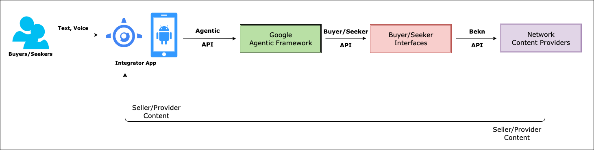

# High-Level Architecture

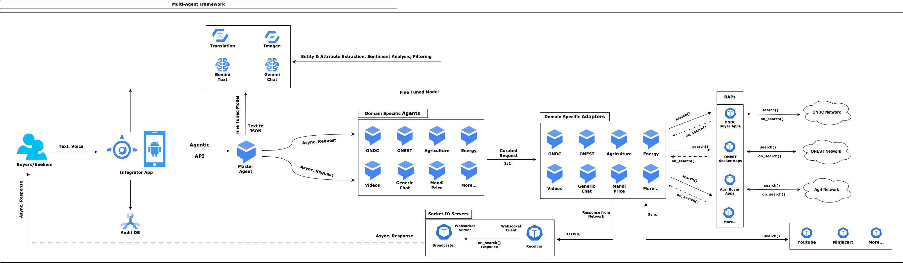

- Multi-agent architecture
- Bridge between Demand and Supply
  - **Demand side**: Buyers/Seekers
  - **Supply side**: BAPs on Open Network, various Digital Content providers who are not on any Open Networks
- User’s Voice command runs through an NLP to understand the Intent
- **Master Agent** is the first responder
  - **Master Agent** connects to Gemini 
  - Responses from Model will return a specific formatted JSON with **Specific Intents** (*which network to go to?*); **Action items** (*Search*) and **Messages** *(corresponding data points to send to the Open Network*)
  - Passes the JSON to Platform specific Sub-Agents
- Responses from each Network is sent back to the front end over a **Websocket connection**
- Each **Sub-agent** act like an independent unit capable to communicate with a specific Open Networks and for a specific domain
  - JSON data from **Master-agent** is processed to convert it into a request for a specific Open Network
  - **Sub-agents** can send the request to Open Networks e.g. ONEST (for *Education, Jobs, Skilling*) or ONDC (for *Retail*) based on the instruction from **Master Agent**
    - **Sub-agents** will send the request to a BAP interfaces in the Open Network like Buyer Apps or Seeker Apps; which in-turn will call the designated Open Network
    - **Providers** on the Open network would respond back to the BAPs as per [Beckn protocol](https://becknprotocol.io/); which in-turn sends the response back to the front end apps (*Buyers/Seekers*)
  - **Sub-agents** can send the request to Content providers outside of any Open Network e.g. Videos, Digital Catalogs, Web/Podcasts etc. based on the instruction from **Master Agent**
    - Each non-Network Content provider can send the digital contents directly to the front end apps (*Buyers/Seekers*)

# Logical View

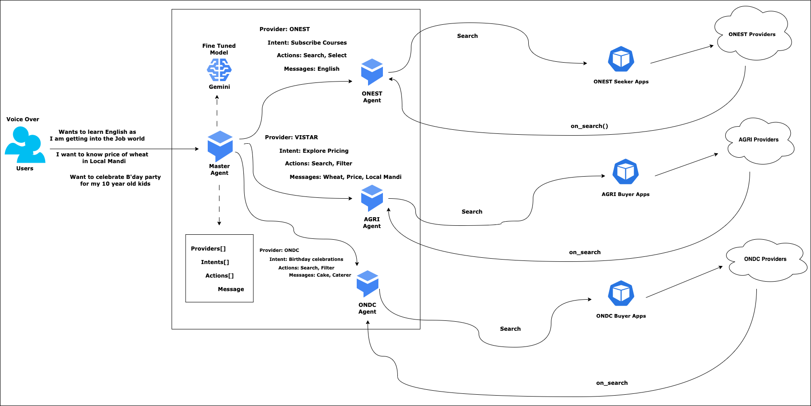

# End to End Workflow

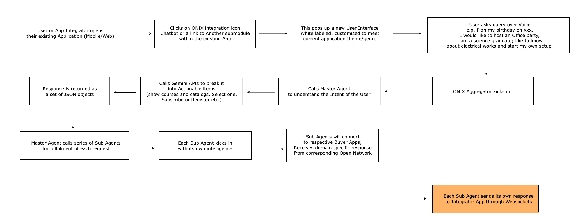

# Sequential Flow

## All Open Networks

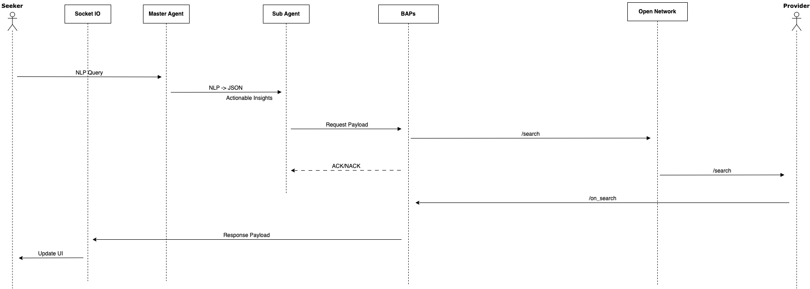


## Integrator Networks (*Outside Open Network*)

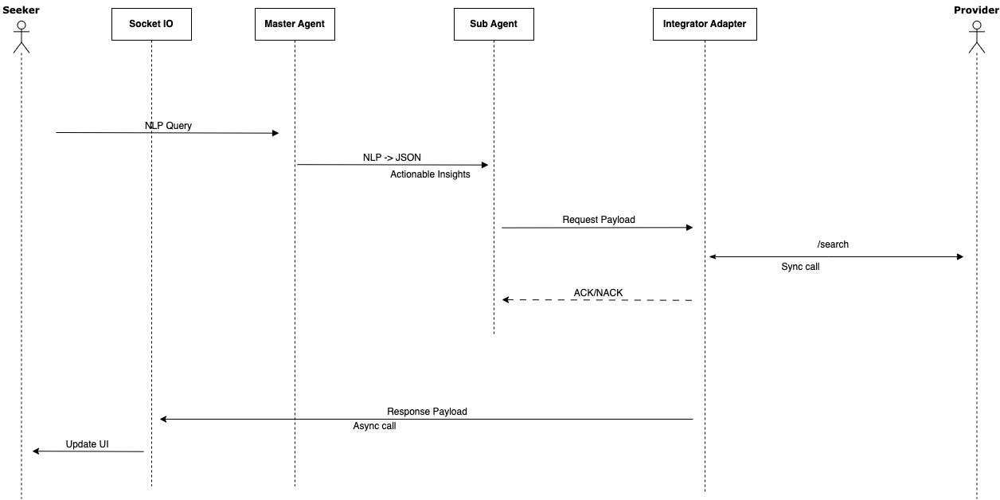


# Integrator App

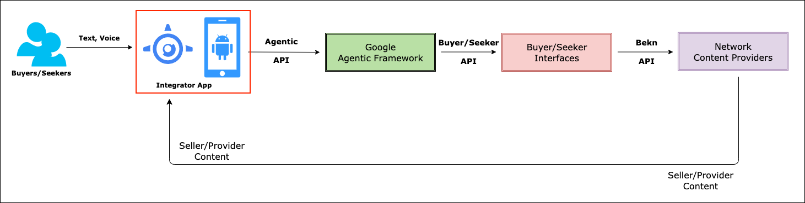

- Integrates with **Google Agentic framework**
- Maintains the state of entire application
- Manages end user preferences viz. Preferred Networks, Intended Verticals of Open Network etc..
- Logs all transactions in an Audit Database asynchronously
- Basic Analytics
- Future Plans
  - Advanced Analytics

# Deployment Approach

## Self Hosted

### Functional

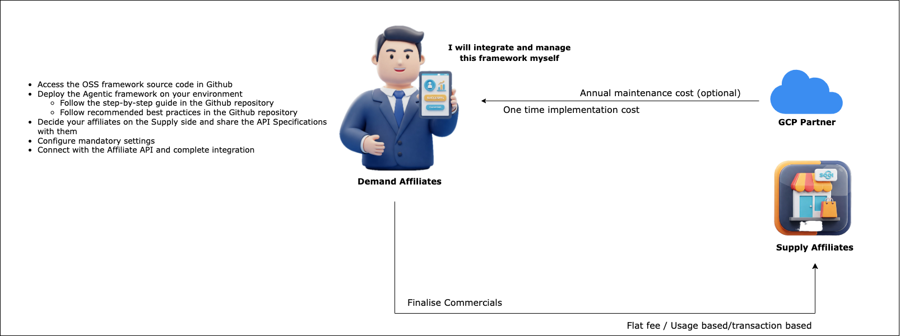


### Technical

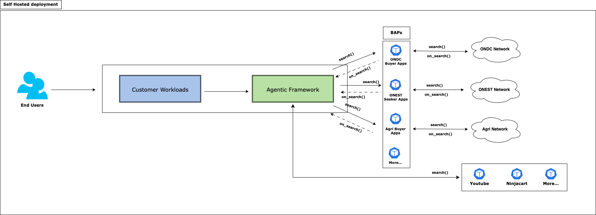

- Single Tenant deployment; separate instance for each customer(s) and their environment(s)
- Fully pluggable with the customer's existing workloads over a secure Private Service Connect endpoint
- Seamless integration with various Open networks (viz. *ONDC, ONEST* etc.) and 3rd party integrators (viz. *Youtube, Ninjacart* etc.)


### Deployment Architecture


## Managed Service Model

### Functional

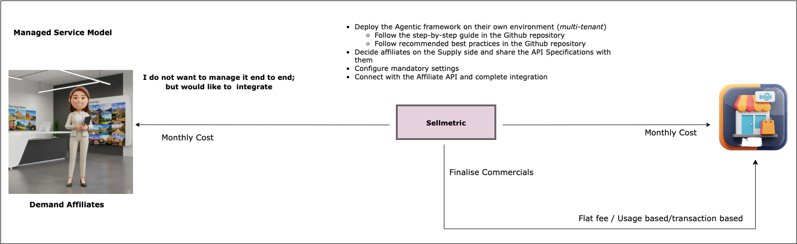


### Technical

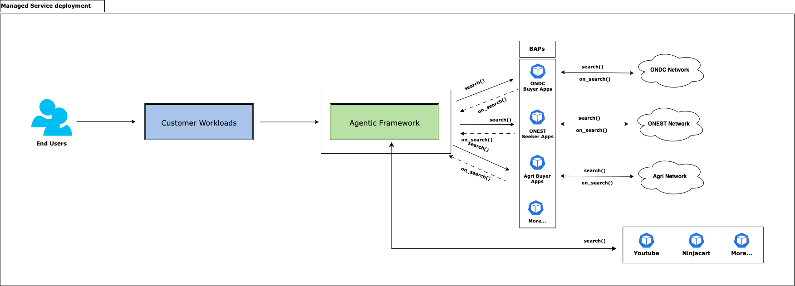


### Deployment Architecture

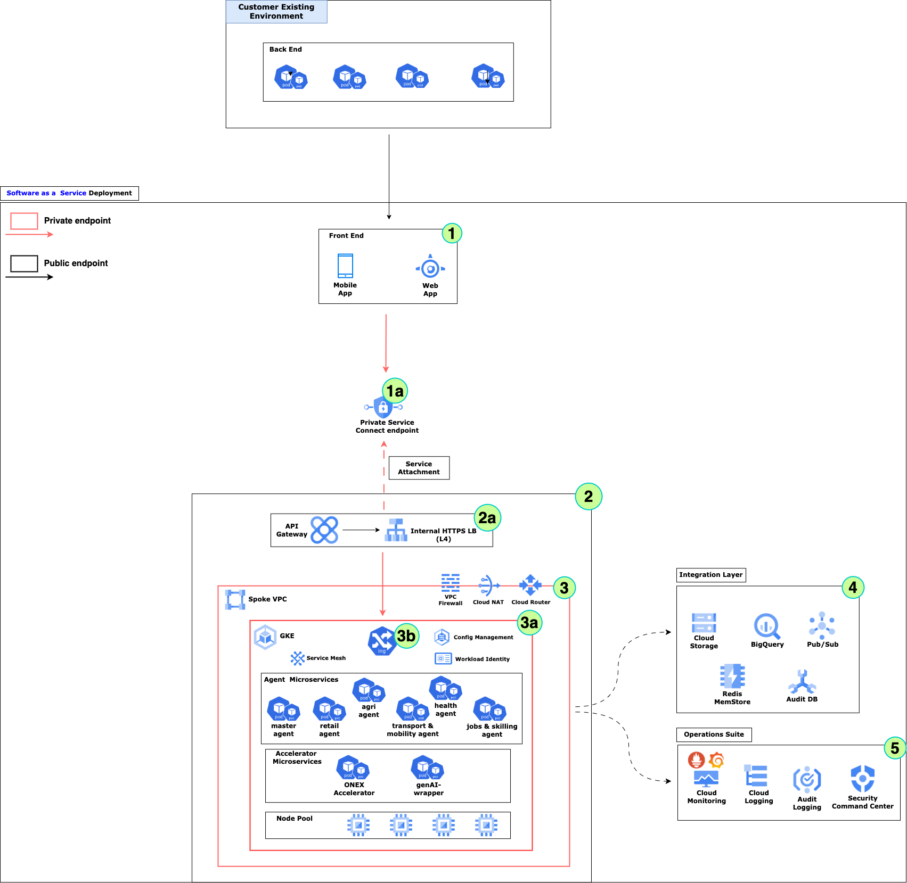

## Prelude

Deployment uses the following tools:

- **Terraform for GCP** - Infrastructure deployment
- **Helm chart** - Application/Micro-services deployment
- **Cloud Build** - YAML scripts which acts as a wrapper around Terraform Deployment scripts

The entire Terraform deployment is divided into 3 stages -

- **Pre-Config** stage
  - Create the Landing Zone for the entire deployment
  - Deploy all resources and services that create the building blocks for the entire deployment
- **Setup** Stage
  - Deploy the Core infrastructure
- **Post-Config** Stage
  - Perform all post configurations
  - Deploy additional resources for integration and end to end flow

### Pre-requisites

- ### [Install the gcloud CLI](https://cloud.google.com/sdk/docs/install)

- #### Alternate

  - #### [Run gcloud commands with Cloud Shell](https://cloud.google.com/shell/docs/run-gcloud-commands)

- [**Install kubectl**](https://cloud.google.com/kubernetes-engine/docs/how-to/cluster-access-for-kubectl#apt)

  ```bash
  sudo apt-get update
  sudo apt-get install kubectl
  kubectl version --client
  
  sudo apt-get install google-cloud-sdk-gke-gcloud-auth-plugin
  ```

- [**Install Helm**](https://helm.sh/docs/intro/install/)

  ```bash
  curl https://baltocdn.com/helm/signing.asc | gpg --dearmor | sudo tee /usr/share/keyrings/helm.gpg > /dev/null
  
  sudo apt-get install apt-transport-https --yes
  
  echo "deb [arch=$(dpkg --print-architecture) signed-by=/usr/share/keyrings/helm.gpg] https://baltocdn.com/helm/stable/debian/ all main" | sudo tee /etc/apt/sources.list.d/helm-stable-debian.list
  
  sudo apt-get update
  sudo apt-get install helm
  
  helm version --client
  ```

- **Cloud Build - [Helm tool builder](https://github.com/GoogleCloudPlatform/cloud-builders-community/tree/master/helm)**

  - This is the helm builder for cloud build

  - Helps automating deployment of applications and other config files on the GKE cluster using Cloud Build

  - Each Cloud Build pipeline script can contain various **helm** commands as the build step

    ```bash
    # Clone Community Cloud Builder repository
    git clone https://github.com/GoogleCloudPlatform/cloud-builders-community/tree/master/helm
    
    # Build Helm package which would be used inside Cloud Build scripts
    gcloud builds submit . --config=cloudbuild.yaml
    ```
    
    > **Note**:
    >
    > This is optional. Any other build tool can be used instead of Cloud Build; but this deployment uses Cloud Build heavily.
    >
    > Helm tool installer is a tool that works with Cloud Build and helps to automate running helm charts as part of the deployment process.


### Workspace - Folder structure

- **Open-Network-Aggregator (*Root Folder*)**
  - **assets**
    - images
    - architecture diagrams
    - ...(more)
  - **backend**
    - **aggregator** - Containers Master Agent and Domain specific Sub-agents to connect to various Content providers
    - **genai** - Wrapper plugin for GCP Generative AI services
    - **utilities** - Contains helper services used across the solution
      - **storage** - A Wrapper around GCS APIs; supports various cloud storage operations viz.  *download a file*, *upload a file* etc.
      - **event-sockets** - Contains [Socket.IO Server](https://socket.io/docs/v4/server-api/) and [Socket.IO Client](https://socket.io/docs/v4/client-api/) for accepting asynchronous callbacks from various Open Networks or Content Providers
      - **websock-streamer** -  Contains [Socket.IO Server](https://socket.io/docs/v4/server-api/) and [Socket.IO Client](https://socket.io/docs/v4/client-api/) for accepting streaming content generated by various generative AI services. In this solution - *Text generation* and **Multi-modal Content generation** - are two services which use this service
    - **vertexai** - Wrapper plugin for GCP VertexAI services
  - **data** - Contains YAML specification of the APIs shared with Content provider partners 
    - This is for internal references only
  - **distribution**
    - **builds**
      - **apps** - Scripts for Deploying/Removing **Application** services
        - Contains **Cloud Build** scripts which can be used from CLI or connected to an SCM for performing CI and CD
      - **cloud-run** - **Cloud Build** scripts for automating the deployment of **Cloud Run** services
      - **gke** - **Cloud Build** scripts for automating the deployment of **GKE** cluster and its subsequent update/deletion
    - **cloud-run** - Scripts for Deploying/Removing **Cloud Run** services
      - Contains Terraform scripts and corresponding variable values
    - **gke** - Scripts for Deploying/Removing/Configuring **GKE** cluster
      - This also contains helm charts for deploying micro-services within the GKE cluster
      - Deploying K8s gateway as Ingress
  - **frontend**
    - **mobile** - Source code for Mobile frontend
    - **web** - Source code for Web frontend
      - Also contains server code for hosting the frontend
  - **misc**
    - Miscellaneous files which are only locally maintained; should not be part of any source code commit or checkin
    - Contains a Text file with step by step command line guidance of the end to end solution build and deployment


## Step-by-Step guide

- Here is a step by step guide on how to deploy this entire infrastructure end to end

### Deploy Fine-tuned model

The framework relies on a gemini-based on a fine-tuned model to understand the intent of the end user (*inferencing by **Master Agent***) and pickup appropriate **Sub Agents** to perform the specific Open Network requests.

#### Examples

**Query**: Show me red coloured handbags

**Step 1**: Inferencing by Master Agent - Intent is Retail (ONDC); route to ONDC Agent

**Step 2**: Action by ONDC Agent - Call all ONDC Affiliates

### How to deploy a fine-tuned model?

This document follows the approach of [Tune Gemini models by using supervised fine-tuning](https://cloud.google.com/vertex-ai/generative-ai/docs/models/gemini-use-supervised-tuning) where a [Text Tuning](https://cloud.google.com/vertex-ai/generative-ai/docs/models/tune_gemini/text_tune) is used to fine tune a Gemini base model.

- Go to **/data/models** folder under root
- Use the example files to fine tune a Gemini base model (e.g. *gemini-flash-002*)
- The saved model will feature in the **[Model Registry](https://cloud.google.com/vertex-ai/docs/model-registry/introduction)** section of Vertex AI

### Setup CLI environment variables

```bash
BASEFOLDERPATH=<Root folder path>
DISTRIBUTION_PATH=$BASEFOLDERPATH/distribution
OWNER=<Project Owner ID>
PROJECT_ID=<Project ID>

(Note: This ideally should be same as PROJECT_ID; or any preferred name to identify the proejct)
PROJECT_NAME=<Project NAME>

(Note: Changing the below naming format for GSA_DISPLAY_NAME and GSA will need some change in the some of the deployment file(s) as explained later)
GSA_DISPLAY_NAME=$PROJECT_NAME-sa
GSA=$GSA_DISPLAY_NAME@$PROJECT_ID.iam.gserviceaccount.com

VPC_NAME=<Name of the VPC containing all subsequent resources>
CLUSTER_SUBNET_NAME=gke-subnet (Optional name; change accordingly)
PROXY_SUBNET_NAME=proxy-subnet (Optional name; change accordingly)
PSC_SUBNET_NAME=psc-subnet (Optional name; change accordingly)
MAINTENANCE_SUBNET_NAME=management_subnet (Optional name; change accordingly)
CLUSTER=<Name of the GKE cluster>
NODEPOOL=<Name of the Nodepool containing the application services>
REGION=<GCP Region of the PROJECT>
ZONE=<GCP Zone of the PROJECT>
IP_ADDRESS_NAME=dev-glb-lb-ip (Optional name; change accordingly)
CERTIFICATE_NAME=<Certificate to be used by GCP LB>

(Optional: No. of environments to be included in the same Certificate)
// DEV
DOMAIN1_NAME=<dev environment to be exposed through GCP LB>

// STAGING
DOMAIN2_NAME=<staging environment to be exposed through GCP LB>

// PROD
DOMAIN3_NAME=<prod environment to be exposed through GCP LB>

(Mandatory: event socket for receiving data asynchronously from various sub-agents)
DOMAIN4_NAME=<Event socket to be exposed through GCP LB>

(Mandatory: streaming socket for receiving strams asynchronously from genetrative AI components)
DOMAIN5_NAME=<Stream socket to be exposed through GCP LB>

(Note: As mentioend above - $DOMAIN1_NAME,$DOMAIN2_NAME,$DOMAIN3_NAME are otional but at least one environemnt should be included)
(Note: As mentioend above - $DOMAIN4_NAME,$DOMAIN5_NAME are mandatory)
DOMAIN_LIST=$DOMAIN1_NAME,$DOMAIN2_NAME,$DOMAIN3_NAME,$DOMAIN4_NAME,$DOMAIN5_NAME

DNS_ZONE=<Cloud DNS Zone>
AR_REPO=<Artifact Registry Repository>
JUMP_SERVER_NAME=<Name of the Jump Server or Bastion Host>
```

> **Note**:
>
> **PROJECT_NAME** - This ideally should be same as *PROJECT_ID*; or any preferred name to identify the project.
>
> **GSA_DISPLAY_NAME** - This is the dIsplay name of a *google service account* to be used across this deployment. The recommended format is **$PROJECT_NAME-sa**
>
> **GSA=$GSA_DISPLAY_NAME@$PROJECT_ID.iam.gserviceaccount.com**
>
> Ideally these formats should not be changed as it might impact multiple deployment steps and hence might need modifications in multiple deployment file(s).


#### Authenticate user to gcloud

```bash
gcloud auth login
gcloud auth list
gcloud config set account $OWNER
```

#### Setup current project

```bash
gcloud config set project $PROJECT_ID

gcloud services enable cloudresourcemanager.googleapis.com
gcloud services enable compute.googleapis.com
gcloud services enable container.googleapis.com
gcloud services enable storage.googleapis.com
gcloud services enable artifactregistry.googleapis.com
gcloud services enable run.googleapis.com
gcloud services enable aiplatform.googleapis.com
gcloud services enable translate.googleapis.com
gcloud services enable texttospeech.googleapis.com
gcloud services enable vision.googleapis.com
gcloud services enable apigee.googleapis.com
gcloud services enable servicenetworking.googleapis.com
gcloud services enable cloudkms.googleapis.com
gcloud services enable mesh.googleapis.com
gcloud services enable certificatemanager.googleapis.com
gcloud services enable cloudbuild.googleapis.com
gcloud services enable sqladmin.googleapis.com
gcloud services enable redis.googleapis.com
gcloud services enable secretmanager.googleapis.com

gcloud config set compute/region $REGION
gcloud config set compute/zone $ZONE
```

#### Setup Service Account

Current authenticated user will handover control to a **Service Account** which would be used for all subsequent resource deployment and management

```bash
gcloud iam service-accounts create $GSA_DISPLAY_NAME --display-name=$GSA_DISPLAY_NAME
gcloud iam service-accounts list

# Make SA as the owner
gcloud projects add-iam-policy-binding $PROJECT_ID --member=serviceAccount:$GSA --role=roles/owner

# ServiceAccountUser role for the SA
gcloud projects add-iam-policy-binding $PROJECT_ID --member=serviceAccount:$GSA --role=roles/iam.serviceAccountUser

# ServiceAccountTokenCreator role for the SA
gcloud projects add-iam-policy-binding $PROJECT_ID --member=serviceAccount:$GSA --role=roles/iam.serviceAccountTokenCreator
```

#### Create Storage Buckets

- Bucket to store **Terraform** state (*if terraform deployment is chosen, as explained later*)

  ```bash
  #This is just an example; please feel free to chose any name here of your choice
  gcloud storage buckets create gs://$PROJECT_ID-terra-stg --location=us-central1
  ```

- Bucket to store various VertexAI and Generative AI resources
  - Contains the fine tuned model for Master Agent which is the heart of Agentic framework

```bash
#This is just an example; please feel free to chose any name here of your choice
gcloud storage buckets create gs://open-network-aggr-stg-<some-random-no> --location=us-central1
```

> **Note**
>
> Important point to note about sharing secured information through deployment files.
>
> This document follows a strict, secured mechanism to share deployment files as every deployment file might have system specific information on where it is getting deployed.
>
> All template deployment files for Helm charts will be shared through a folder called **values.tpl**; which can be found under:
>
> - **/distribution/gke/charts**
>
> **Action**
>
> - Copy **values.tpl** to a folder named as **values**
> - Modify all template files inside newly created **values** folder with the values respective to the target system
> - All subsequent deployment steps will use the **values** folder
>
> All template deployment files for K8s Gateway API will be shared through a folder called **k8s-api-gateway.tpl**; which can be found under:
>
> - **/distribution/gke/k8s-api-gateway**
>
> **Action**
>
> - Copy **k8s-api-gateway.tpl** to a folder named as **k8s-api-gateway**
> - Modify all template files inside newly created **k8s-api-gateway** folder with the values respective to the target system
> - All subsequent deployment steps will use the **k8s-api-gateway** folder


## Deployment Methodology

- ### Manual

  - Deploy all **Infrastructure**  and **Service** components step by step using **gcloud CLI**

    

- ### Automated

  - Deploy all **Infrastructure**  and **Service** components step by step using **Terraform** scripts in just 2 steps
    - **Pre-Config**
    - **Setup**


## Step by Step guide for Automated (*Terraform*) based Deployment

- All steps of manual deployment is clubbed into only to steps

  - ### Pre-Config

    ```bash
    #This is used to refer the Google Service account by the Cloud Build script
    #GSA format - projects/${_PROJECT_ID_}/serviceAccounts/${_PROJECT_NAME_}-sa@${_PROJECT_ID_}.iam.gserviceaccount.com
    PROJECT_NAME=
    
    DISTRIBUTION_PATH="$BASEFOLDERPATH/distribution"
    WORKING_DIR="gke/cluster/scripts/pre-config"
    TFVARS_PATH="../../values/dev/pre-config"
    TFVARS_FILE_PATH=$TFVARS_PATH/pre-config.tfvars
    BACKEND_CONFIG=$TFVARS_PATH/backend.config
    
    cd $DISTRIBUTION_PATH
    
    gcloud builds submit --config="./builds/gke/gke-deployment.yaml" \
    --project=$PROJECT_ID --substitutions=_PROJECT_ID_=$PROJECT_ID,_PROJECT_NAME_=$PROJECT_NAME,\
    _WORKING_DIR_=$WORKING_DIR,_TFVARS_FILE_PATH_=$TFVARS_FILE_PATH,\
    _BACKEND_CONFIG_="$BACKEND_CONFIG",_LOG_BUCKET_=$PROJECT_ID-terra-stg
    
    #gcloud builds submit --config="./builds/gke/gke-destroy.yaml" \
    --project=$PROJECT_ID --substitutions=_PROJECT_ID_=$PROJECT_ID,_PROJECT_NAME_=$PROJECT_NAME,\
    _WORKING_DIR_=$WORKING_DIR,_TFVARS_FILE_PATH_=$TFVARS_FILE_PATH,\
    _BACKEND_CONFIG_="$BACKEND_CONFIG",_LOG_BUCKET_=$PROJECT_ID-terra-stg
    ```

  - ### Setup

    ```bash
    #This is used to refer the Google Service account by the Cloud Build script
    #GSA format - projects/${_PROJECT_ID_}/serviceAccounts/${_PROJECT_NAME_}-sa@${_PROJECT_ID_}.iam.gserviceaccount.com
    PROJECT_NAME=
    
    DISTRIBUTION_PATH="$BASEFOLDERPATH/distribution"
    WORKING_DIR="gke/cluster/scripts/setup"
    TFVARS_PATH="../../values/dev/setup"
    TFVARS_FILE_PATH=$TFVARS_PATH/setup.tfvars
    BACKEND_CONFIG=$TFVARS_PATH/backend.config
    
    cd $DISTRIBUTION_PATH
    
    gcloud builds submit --config="./builds/gke/gke-deployment.yaml" \
    --project=$PROJECT_ID --substitutions=_PROJECT_ID_=$PROJECT_ID,_PROJECT_NAME_=$PROJECT_NAME,\
    _WORKING_DIR_=$WORKING_DIR,_TFVARS_FILE_PATH_=$TFVARS_FILE_PATH,\
    _BACKEND_CONFIG_="$BACKEND_CONFIG",_LOG_BUCKET_=$PROJECT_ID-terra-stg
    
    #gcloud builds submit --config="./builds/gke/gke-destroy.yaml" \
    --project=$PROJECT_ID --substitutions=_PROJECT_ID_=$PROJECT_ID,_PROJECT_NAME_=$PROJECT_NAME,\
    _WORKING_DIR_=$WORKING_DIR,_TFVARS_FILE_PATH_=$TFVARS_FILE_PATH,\
    _BACKEND_CONFIG_="$BACKEND_CONFIG",_LOG_BUCKET_=$PROJECT_ID-terra-stg
    ```


## Step by Step guide for Manual (*gcloud CLI*) Deployment

### Artifact Registry

```bash
#Create Repository
gcloud artifacts repositories create $AR_REPO --repository-format=docker --location=$REGION

#List Repository
gcloud artifacts repositories list --location=$REGION

#Describe Repository
gcloud artifacts repositories describe $AR_REPO --location=$REGION

#gcloud artifacts repositories delete $AR_REPO --location=$REGION
```

### Network

```bash
gcloud compute networks create $VPC_NAME --subnet-mode=custom --bgp-routing-mode=regional --mtu=1460
#gcloud compute networks delete $VPC_NAME

gcloud compute networks subnets create $CLUSTER_SUBNET_NAME --network=$VPC_NAME --range=10.0.0.0/22 --region=$REGION
#gcloud compute networks subnets delete $CLUSTER_SUBNET_NAME --region=$REGION

gcloud compute networks subnets create $PSC_SUBNET_NAME --purpose=PRIVATE_SERVICE_CONNECT --role=ACTIVE \
--network=$VPC_NAME --range=10.0.4.0/24
#gcloud compute networks subnets delete $PSC_SUBNET_NAME

gcloud compute networks subnets create $PROXY_SUBNET_NAME --purpose=REGIONAL_MANAGED_PROXY --role=ACTIVE \
--network=$VPC_NAME  --range=10.0.5.0/24
#gcloud compute networks subnets delete $PROXY_SUBNET_NAME

gcloud compute networks subnets update $CLUSTER_SUBNET_NAME \
--add-secondary-ranges=pods-range=10.1.0.0/16,services-range=10.2.0.0/16
#gcloud compute networks subnets delete $CLUSTER_SUBNET_NAME

gcloud compute networks subnets create $MAINTENANCE_SUBNET_NAME --network=$VPC_NAME --range=10.0.6.0/24
#gcloud compute networks subnets delete $MAINTENANCE_SUBNET_NAME

gcloud compute networks subnets list --network=$VPC_NAME
```

### Firewall Rules

```bash
gcloud compute firewall-rules create allow-egress --allow=all --destination-ranges=0.0.0.0/0 \
--direction=EGRESS --network=$VPC_NAME --priority=100
gcloud compute firewall-rules delete allow-egress

gcloud compute firewall-rules create allow-http-ingress --allow=tcp:80,tcp:443 --source-ranges=0.0.0.0/0 \
--direction=INGRESS --network=$VPC_NAME --priority=100
#gcloud compute firewall-rules delete allow-http-ingress

gcloud compute firewall-rules create allow-ssh --allow=tcp:22 --source-ranges=0.0.0.0/0 \
--direction=INGRESS --network=$VPC_NAME --priority=101
#gcloud compute firewall-rules delete allow-ssh

gcloud compute firewall-rules create allow-gcp-health-check --network=$VPC_NAME \
--action=allow --direction=INGRESS --source-ranges=130.211.0.0/22,35.191.0.0/16 \
--rules=tcp --priority=103
#gcloud compute firewall-rules delete allow-gcp-health-check

gcloud compute firewall-rules create allow-gcp-proxies --network=$VPC_NAME \
--action=allow --direction=INGRESS --source-ranges=10.0.5.0/24 \
--rules=tcp:80,tcp:443,tcp:8080 --priority=104
#gcloud compute firewall-rules delete allow-gcp-proxies

gcloud compute firewall-rules  list --format="table(name, network)" --filter="network=$VPC_NAME"
```

### Bastion Host

- This is primarily for Private GKE cluster where all access to the control plane is blocked
-  Bastion Host acts the single point entry to GKE cluster and also to other services/resources which are behind a private IP or endpoint
- Good practice to have Bastion host or Jump server for such an end to end deployment

```bash
gcloud compute addresses create jump-server-ip --region=$REGION
#gcloud compute addresses delete jump-server-ip
JUMPSERVER_IP=$(gcloud compute addresses describe jump-server-ip --format="get(address)")

gcloud compute addresses create jump-server-private-ip --subnet=$MAINTENANCE_SUBNET_NAME \
--addresses=10.0.6.100 --region=$REGION
JUMPSERVER_PRIVATE_IP=$(gcloud compute addresses describe jump-server-private-ip --format="get(address)")
#gcloud compute addresses delete jump-server-private-ip

gcloud compute instances create $JUMP_SERVER_NAME --machine-type=n2d-standard-2 \
--image-family=ubuntu-pro-2004-lts --image-project=ubuntu-os-pro-cloud \
--network=$VPC_NAME --subnet=$MAINTENANCE_SUBNET_NAME --address=$JUMPSERVER_IP \
--private-network-ip=$JUMPSERVER_PRIVATE_IP --zone=$ZONE --project=$PROJECT_ID
#gcloud compute instances delete $JUMP_SERVER_NAME --zone=$ZONE --project=$PROJECT_ID

gcloud compute instances describe $JUMP_SERVER_NAME --format="get(networkInterfaces[0].networkIP)" \
--project=$PROJECT_ID
gcloud compute instances describe $JUMP_SERVER_NAME --format="get(networkInterfaces[0].accessConfigs[0].natIP)" \
--project=$PROJECT_ID
```

### Create GKE Cluster

#### Private Cluster

```bash
gcloud container clusters create $CLUSTER --release-channel=regular --region=$REGION \
--enable-ip-alias --machine-type=n2d-standard-2 --gateway-api=standard \
--num-nodes=1 --max-pods-per-node=40 \
--network=$VPC_NAME --subnetwork=$CLUSTER_SUBNET_NAME \
--cluster-secondary-range-name=pods-range --services-secondary-range-name=services-range \
--service-account=$GSA --workload-pool=$PROJECT_ID.svc.id.goog \
--enable-master-authorized-networks --enable-private-nodes --enable-private-endpoint \
--master-authorized-networks=$JUMPSERVER_PRIVATE_IP/32 --master-ipv4-cidr=10.0.7.0/28 \
--addons GcsFuseCsiDriver,HttpLoadBalancing
#gcloud container clusters delete $CLUSTER --region=$REGION
```

#### Public Cluster

```bash
gcloud container clusters create $CLUSTER --release-channel=regular --region=$REGION \
--enable-ip-alias --machine-type=n2d-standard-2 --gateway-api=standard \
--num-nodes=1 --max-pods-per-node=40 \
--network=$VPC_NAME --subnetwork=$CLUSTER_SUBNET_NAME \
--cluster-secondary-range-name=pods-range --services-secondary-range-name=services-range \
--service-account=$GSA --workload-pool=$PROJECT_ID.svc.id.goog \
--addons GcsFuseCsiDriver,HttpLoadBalancing
#gcloud container clusters delete $CLUSTER --region=$REGION
```

### Create Application Node pool

- To host only application services

```bash
gcloud container node-pools create $NODEPOOL --cluster=$CLUSTER --region=$REGION \
--num-nodes=1 --enable-autoscaling --machine-type=n2d-standard-4 \
--min-nodes=1 --max-nodes=50 --max-pods-per-node=30 \
--service-account=$GSA
#gcloud container node-pools delete gkeappspool --cluster=$CLUSTER --region=$REGION
```

#### Create SSL Certificate

```bash
gcloud compute ssl-certificates create $CERTIFICATE_NAME --domains=$DOMAIN_LIST --global
gcloud compute ssl-certificates list --global
#gcloud compute ssl-certificates delete glb-$CERTIFICATE_NAME
```

#### IP Address

```bash
gcloud compute addresses create $IP_ADDRESS_NAME --ip-version=IPV4 --global
gcloud compute addresses describe $IP_ADDRESS_NAME --format="get(address)" --global
#gcloud compute addresses delete $IP_ADDRESS_NAME --global
```

#### Add DNS Records

```bash
#Add DNS Records
GLB_IP=$(gcloud compute addresses describe $IP_ADDRESS_NAME --format="get(address)" --global)

gcloud dns record-sets create $DOMAIN1_NAME --rrdatas=$GLB_IP \
--type=A --ttl=60 --zone=$DNS_ZONE
#gcloud dns record-sets delete $DOMAIN1_NAME --type=A --zone=$DNS_ZONE
```


### Let us Build the Micro-services

- Following micro-services are coming out-of-the-box with this deployment

- Please feel free to choose suitable replacement of these services

  
  
  > **Important Note**
  >
  > Please Refer to the section [Setup CLI environment variables](#Setup CLI environment variables).
  >
  > If the variable naming convention of PROJECT_NAME, GSA_DISPLAY_NAME and GSA are changed then there will be a modification needed in the [app-deployment.yaml](https://github.com/monojit18/Open-Network-Aggregator/blob/BR-Pilot-GKE-Backend-01122024/distribution/builds/app/app-deployment.yaml) file as explained below. This should be done before running the build operations for any micro-services
  >
  > **Line 9** - serviceAccount: "projects/${_PROJECT_ID_}/serviceAccounts/**${_PROJECT_NAME_}-sa**@${_PROJECT_ID_}.iam.gserviceaccount.com"
  >
  > - The highlighted value needs to be replaced by the one used in the [Setup CLI environment variables](#Setup CLI environment variables) section
  >
  > **Line 13** - **_PROJECT_NAME_** This variable needs to be removed from the file if not used
  >
  > 
  >
  > **gcloud build** command -
  >
  > Every build script call should be replaced by the following one, which removes all references of _PROJECT_NAME_ variable
  >
  > 
  >
  > **gcloud builds submit --config="$DISTRIBUTION_PATH/builds/app/app-deployment.yaml" \
  > --project=$PROJECT_ID --substitutions=_PROJECT_ID_=$PROJECT_ID,_REGION_=$REGION,\
  > _REPO_NAME_=$REPO_NAME,_PACKAGE_NAME_=$PACKAGE_NAME,_PACKAGE_VERSION_=$PACKAGE_VERSION,\
  > _LOG_BUCKET_=$PROJECT_ID-terra-stg**
  >
  > 
  
  

### Utility Services

#### Streamer Server

- [Socket.IO](https://socket.io/docs/v4/server-installation/) Server that broadcasts streaming messages from genai layer
- Intended clients (e.g. *Front end layer*) should listen to these messages and update accordingly

```bash
cd $BASEFOLDERPATH/backend/utilities/websock-streamer/server
PROJECT_NAME=<PROJECT_NAME>
REPO_NAME=$AR_REPO
PACKAGE_NAME=streamer-serverlib
PACKAGE_VERSION="v1.0"

gcloud builds submit --config="$DISTRIBUTION_PATH/builds/app/app-deployment.yaml" \
--project=$PROJECT_ID --substitutions=_PROJECT_ID_=$PROJECT_ID,_PROJECT_NAME_=$PROJECT_NAME,_REGION_=$REGION,\
_REPO_NAME_=$REPO_NAME,_PACKAGE_NAME_=$PACKAGE_NAME,_PACKAGE_VERSION_=$PACKAGE_VERSION,\
_LOG_BUCKET_=$PROJECT_ID-terra-stg
```

#### Event Server

- [Socket.IO](https://socket.io/docs/v4/server-installation/) Server that broadcasts event messages from adapters
- Intended clients (e.g. *Front end layer*) should listen to these messages and update accordingly

```bash
cd $BASEFOLDERPATH/backend/utilities/event-sockets/event-server
PROJECT_NAME=<PROJECT_NAME>
REPO_NAME=$AR_REPO
PACKAGE_NAME=event-serverlib
PACKAGE_VERSION=v1.0

gcloud builds submit --config="$DISTRIBUTION_PATH/builds/app/app-deployment.yaml" \
--project=$PROJECT_ID --substitutions=_PROJECT_ID_=$PROJECT_ID,_PROJECT_NAME_=$PROJECT_NAME,_REGION_=$REGION,\
_REPO_NAME_=$REPO_NAME,_PACKAGE_NAME_=$PACKAGE_NAME,_PACKAGE_VERSION_=$PACKAGE_VERSION,\
_LOG_BUCKET_=$PROJECT_ID-terra-stg
```

#### Event Receiver

- Acts like a [Socket.IO](https://socket.io/docs/v4/client-installation/) client for the [Event Server](#Event Server) for the entire suite of micro-services
- Receives messages from Adapters over http
- Sends the message to [Event Server](#Event Server) to broadcast to corresponding clients

```bash
cd $BASEFOLDERPATH/backend/utilities/event-sockets/event-receiver
PROJECT_NAME=<PROJECT_NAME>
REPO_NAME=$AR_REPO
PACKAGE_NAME=event-receiverlib
PACKAGE_VERSION=v1.0

gcloud builds submit --config="$DISTRIBUTION_PATH/builds/app/app-deployment.yaml" \
--project=$PROJECT_ID --substitutions=_PROJECT_ID_=$PROJECT_ID,_PROJECT_NAME_=$PROJECT_NAME,_REGION_=$REGION,\
_REPO_NAME_=$REPO_NAME,_PACKAGE_NAME_=$PACKAGE_NAME,_PACKAGE_VERSION_=$PACKAGE_VERSION,\
_LOG_BUCKET_=$PROJECT_ID-terra-stg
```

#### Storage

- Wrapper around **GCS** services

```bash
cd $BASEFOLDERPATH/backend/vertexai/storage
PROJECT_NAME=<PROJECT_NAME>
REPO_NAME=$AR_REPO
PACKAGE_NAME=storagelib
PACKAGE_VERSION="v1.0"

gcloud builds submit --config="$BASEFOLDERPATH/distribution/builds/app/app-deployment.yaml" \
--project=$PROJECT_ID --substitutions=_PROJECT_ID_=$PROJECT_ID,_PROJECT_NAME_=$PROJECT_NAME,_REGION_=$REGION,\
_REPO_NAME_=$REPO_NAME,_PACKAGE_NAME_=$PACKAGE_NAME,_PACKAGE_VERSION_=$PACKAGE_VERSION,\
_LOG_BUCKET_=$PROJECT_ID-terra-stg
```


### Vertexai Services

#### Vision

- Wrapper around **VertexAI - Cloud Vision** services

```bash
cd $BASEFOLDERPATH/backend/vertexai/vision
PROJECT_NAME=<PROJECT_NAME>
REPO_NAME=$AR_REPO
PACKAGE_NAME=visionlib
PACKAGE_VERSION=v1.0

gcloud builds submit --config="$BASEFOLDERPATH/distribution/builds/app/app-deployment.yaml" \
--project=$PROJECT_ID --substitutions=_PROJECT_ID_=$PROJECT_ID,_PROJECT_NAME_=$PROJECT_NAME,_REGION_=$REGION,\
_REPO_NAME_=$REPO_NAME,_PACKAGE_NAME_=$PACKAGE_NAME,_PACKAGE_VERSION_=$PACKAGE_VERSION,\
_LOG_BUCKET_=$PROJECT_ID-terra-stg
```

#### Speech

- Wrapper around **VertexAI - Cloud Speech-to-Text** services

```bash
cd $BASEFOLDERPATH/backend/vertexai/speech
PROJECT_NAME=<PROJECT_NAME>
REPO_NAME=$AR_REPO
PACKAGE_NAME=speechlib
PACKAGE_VERSION=v1.0

gcloud builds submit --config="$BASEFOLDERPATH/distribution/builds/app/app-deployment.yaml" \
--project=$PROJECT_ID --substitutions=_PROJECT_ID_=$PROJECT_ID,_PROJECT_NAME_=$PROJECT_NAME,_REGION_=$REGION,\
_REPO_NAME_=$REPO_NAME,_PACKAGE_NAME_=$PACKAGE_NAME,_PACKAGE_VERSION_=$PACKAGE_VERSION,\
_LOG_BUCKET_=$PROJECT_ID-terra-stg
```

#### Translation

- Wrapper around **VertexAI - Cloud Translation** services

```bash
cd $BASEFOLDERPATH/backend/vertexai/translation
PROJECT_NAME=<PROJECT_NAME>
REPO_NAME=$AR_REPO
PACKAGE_NAME=translatelib
PACKAGE_VERSION=v1.0

gcloud builds submit --config="$BASEFOLDERPATH/distribution/builds/app/app-deployment.yaml" \
--project=$PROJECT_ID --substitutions=_PROJECT_ID_=$PROJECT_ID,_PROJECT_NAME_=$PROJECT_NAME,_REGION_=$REGION,\
_REPO_NAME_=$REPO_NAME,_PACKAGE_NAME_=$PACKAGE_NAME,_PACKAGE_VERSION_=$PACKAGE_VERSION,\
_LOG_BUCKET_=$PROJECT_ID-terra-stg
```


### Generative AI Services

#### Imagegen

- Wrapper around **Generative AI - Imagen** services

```bash
cd $BASEFOLDERPATH/backend/genai/image
PROJECT_NAME=<PROJECT_NAME>
REPO_NAME=$AR_REPO
PACKAGE_NAME="genai-imagelib"
PACKAGE_VERSION="v1.0"

gcloud builds submit --config="$BASEFOLDERPATH/distribution/builds/app/app-deployment.yaml" \
--project=$PROJECT_ID --substitutions=_PROJECT_ID_=$PROJECT_ID,_PROJECT_NAME_=$PROJECT_NAME,_REGION_=$REGION,\
_REPO_NAME_=$REPO_NAME,_PACKAGE_NAME_=$PACKAGE_NAME,_PACKAGE_VERSION_=$PACKAGE_VERSION,\
_LOG_BUCKET_=$PROJECT_ID-terra-stg
```

#### Textgen

- Wrapper around **Generative AI - Gemini** services

```bash
cd $BASEFOLDERPATH/backend/genai/text
PROJECT_NAME=<PROJECT_NAME>
REPO_NAME=$AR_REPO
PACKAGE_NAME=genai-textlib
PACKAGE_VERSION=v1.0

gcloud builds submit --config="$BASEFOLDERPATH/distribution/builds/app/app-deployment.yaml" \
--project=$PROJECT_ID --substitutions=_PROJECT_ID_=$PROJECT_ID,_PROJECT_NAME_=$PROJECT_NAME,_REGION_=$REGION,\
_REPO_NAME_=$REPO_NAME,_PACKAGE_NAME_=$PACKAGE_NAME,_PACKAGE_VERSION_=$PACKAGE_VERSION,\
_LOG_BUCKET_=$PROJECT_ID-terra-stg
```

#### MultiModal

- Wrapper around **Generative AI - Gemini Multimodal** services

```bash
cd $BASEFOLDERPATH/backend/genai/multimodal
PROJECT_NAME=<PROJECT_NAME>
REPO_NAME=$AR_REPO
PACKAGE_NAME=genai-multimodallib
PACKAGE_VERSION=v1.0

gcloud builds submit --config="$BASEFOLDERPATH/distribution/builds/app/app-deployment.yaml" \
--project=$PROJECT_ID --substitutions=_PROJECT_ID_=$PROJECT_ID,_PROJECT_NAME_=$PROJECT_NAME,_REGION_=$REGION,\
_REPO_NAME_=$REPO_NAME,_PACKAGE_NAME_=$PACKAGE_NAME,_PACKAGE_VERSION_=$PACKAGE_VERSION,\
_LOG_BUCKET_=$PROJECT_ID-terra-stg
```


### Domain specific Services

### Adapters

#### Agri Adapter

```bash
cd $BASEFOLDERPATH/backend/aggregators/adapters/agri
PROJECT_NAME=<PROJECT_NAME>
REPO_NAME=$AR_REPO
PACKAGE_NAME=agri-adapter
PACKAGE_VERSION=v1.0

gcloud builds submit --config="$BASEFOLDERPATH/distribution/builds/app/app-deployment.yaml" \
--project=$PROJECT_ID --substitutions=_PROJECT_ID_=$PROJECT_ID,_PROJECT_NAME_=$PROJECT_NAME,_REGION_=$REGION,\
_REPO_NAME_=$REPO_NAME,_PACKAGE_NAME_=$PACKAGE_NAME,_PACKAGE_VERSION_=$PACKAGE_VERSION,\
_LOG_BUCKET_=$PROJECT_ID-terra-stg
```

#### Buyer Adapter

```bash
cd $BASEFOLDERPATH/backend/aggregators/adapters/buyer
PROJECT_NAME=<PROJECT_NAME>
REPO_NAME=$AR_REPO
PACKAGE_NAME=buyer-adapter
PACKAGE_VERSION=v1.0

gcloud builds submit --config="$BASEFOLDERPATH/distribution/builds/app/app-deployment.yaml" \
--project=$PROJECT_ID --substitutions=_PROJECT_ID_=$PROJECT_ID,_PROJECT_NAME_=$PROJECT_NAME,_REGION_=$REGION,\
_REPO_NAME_=$REPO_NAME,_PACKAGE_NAME_=$PACKAGE_NAME,_PACKAGE_VERSION_=$PACKAGE_VERSION,\
_LOG_BUCKET_=$PROJECT_ID-terra-stg
```

#### Video Adapter

```bash
cd $BASEFOLDERPATH/backend/aggregators/adapters/video
PROJECT_NAME=<PROJECT_NAME>
REPO_NAME=$AR_REPO
PACKAGE_NAME=video-adapter
PACKAGE_VERSION=v1.0

gcloud builds submit --config="$BASEFOLDERPATH/distribution/builds/app/app-deployment.yaml" \
--project=$PROJECT_ID --substitutions=_PROJECT_ID_=$PROJECT_ID,_PROJECT_NAME_=$PROJECT_NAME,_REGION_=$REGION,\
_REPO_NAME_=$REPO_NAME,_PACKAGE_NAME_=$PACKAGE_NAME,_PACKAGE_VERSION_=$PACKAGE_VERSION,\
_LOG_BUCKET_=$PROJECT_ID-terra-stg
```

#### Weather Adapter

```bash
cd $BASEFOLDERPATH/backend/aggregators/adapters/weather
PROJECT_NAME=<PROJECT_NAME>
REPO_NAME=$AR_REPO
PACKAGE_NAME=weather-adapter
PACKAGE_VERSION=v1.0

gcloud builds submit --config="$BASEFOLDERPATH/distribution/builds/app/app-deployment.yaml" \
--project=$PROJECT_ID --substitutions=_PROJECT_ID_=$PROJECT_ID,_PROJECT_NAME_=$PROJECT_NAME,_REGION_=$REGION,\
_REPO_NAME_=$REPO_NAME,_PACKAGE_NAME_=$PACKAGE_NAME,_PACKAGE_VERSION_=$PACKAGE_VERSION,\
_LOG_BUCKET_=$PROJECT_ID-terra-stg
```

#### MANDI Adapter

```bash
cd $BASEFOLDERPATH/backend/aggregators/adapters/mandi
PROJECT_NAME=<PROJECT_NAME>
REPO_NAME=$AR_REPO
PACKAGE_NAME=mandi-adapter
PACKAGE_VERSION=v1.0

gcloud builds submit --config="$BASEFOLDERPATH/distribution/builds/app/app-deployment.yaml" \
--project=$PROJECT_ID --substitutions=_PROJECT_ID_=$PROJECT_ID,_PROJECT_NAME_=$PROJECT_NAME,_REGION_=$REGION,\
_REPO_NAME_=$REPO_NAME,_PACKAGE_NAME_=$PACKAGE_NAME,_PACKAGE_VERSION_=$PACKAGE_VERSION,\
_LOG_BUCKET_=$PROJECT_ID-terra-stg
```

#### LLM Adapter

```bash
cd $BASEFOLDERPATH/backend/aggregators/adapters/llm
PROJECT_NAME=<PROJECT_NAME>
REPO_NAME=$AR_REPO
PACKAGE_NAME=llm-adapter
PACKAGE_VERSION=v1.0

gcloud builds submit --config="$BASEFOLDERPATH/distribution/builds/app/app-deployment.yaml" \
--project=$PROJECT_ID --substitutions=_PROJECT_ID_=$PROJECT_ID,_PROJECT_NAME_=$PROJECT_NAME,_REGION_=$REGION,\
_REPO_NAME_=$REPO_NAME,_PACKAGE_NAME_=$PACKAGE_NAME,_PACKAGE_VERSION_=$PACKAGE_VERSION,\
_LOG_BUCKET_=$PROJECT_ID-terra-stg
```


### Agents

- Agents are of broadly categorised into 2 types

  - #### Master Agents

    - These Agents receive commands in plain text
    - Using a gemini based fine-tuned model, extracts or interprets the actual intent of the user
    - Based on the interpreted intent, routes the request to an appropriate Sub Agent who can serve the request

  - #### Sub Agents

    - Sub Agents are of divided into 2 types
      - Network Agents who works directly with the Open Networks
        - viz. ONDC, ONEST, AGRI
      - 3rd party Integraor Agents who works with various 3rd party integrators
        - viz. Video, LLM, Mandi, Weather

#### Master Agent

```bash
cd $BASEFOLDERPATH/backend/aggregators/agents/master
PROJECT_NAME=<PROJECT_NAME>
REPO_NAME=$AR_REPO
PACKAGE_NAME=master-agent
PACKAGE_VERSION=v1.0

gcloud builds submit --config="$BASEFOLDERPATH/distribution/builds/app/app-deployment.yaml" \
--project=$PROJECT_ID --substitutions=_PROJECT_ID_=$PROJECT_ID,_PROJECT_NAME_=$PROJECT_NAME,_REGION_=$REGION,\
_REPO_NAME_=$REPO_NAME,_PACKAGE_NAME_=$PACKAGE_NAME,_PACKAGE_VERSION_=$PACKAGE_VERSION,\
_LOG_BUCKET_=$PROJECT_ID-terra-stg
```

#### Agri Agent

```bash
cd $BASEFOLDERPATH/backend/aggregators/agents/networks/agri
PROJECT_NAME=<PROJECT_NAME>
REPO_NAME=$AR_REPO
PACKAGE_NAME=agri-agent
PACKAGE_VERSION=v1.0

gcloud builds submit --config="$BASEFOLDERPATH/distribution/builds/app/app-deployment.yaml" \
--project=$PROJECT_ID --substitutions=_PROJECT_ID_=$PROJECT_ID,_PROJECT_NAME_=$PROJECT_NAME,_REGION_=$REGION,\
_REPO_NAME_=$REPO_NAME,_PACKAGE_NAME_=$PACKAGE_NAME,_PACKAGE_VERSION_=$PACKAGE_VERSION,\
_LOG_BUCKET_=$PROJECT_ID-terra-stg
```

#### ONDC Agent

```bash
cd $BASEFOLDERPATH/backend/aggregators/agents/networks/ondc
PROJECT_NAME=<PROJECT_NAME>
REPO_NAME=$AR_REPO
PACKAGE_NAME=ondc-agent
PACKAGE_VERSION=v1.0

gcloud builds submit --config="$BASEFOLDERPATH/distribution/builds/app/app-deployment.yaml" \
--project=$PROJECT_ID --substitutions=_PROJECT_ID_=$PROJECT_ID,_PROJECT_NAME_=$PROJECT_NAME,_REGION_=$REGION,\
_REPO_NAME_=$REPO_NAME,_PACKAGE_NAME_=$PACKAGE_NAME,_PACKAGE_VERSION_=$PACKAGE_VERSION,\
_LOG_BUCKET_=$PROJECT_ID-terra-stg
```

#### Video Agent

```bash
cd $BASEFOLDERPATH/backend/aggregators/agents/integrators/video
PROJECT_NAME=<PROJECT_NAME>
REPO_NAME=$AR_REPO
PACKAGE_NAME=video-agent
PACKAGE_VERSION=v1.0

gcloud builds submit --config="$BASEFOLDERPATH/distribution/builds/app/app-deployment.yaml" \
--project=$PROJECT_ID --substitutions=_PROJECT_ID_=$PROJECT_ID,_PROJECT_NAME_=$PROJECT_NAME,_REGION_=$REGION,\
_REPO_NAME_=$REPO_NAME,_PACKAGE_NAME_=$PACKAGE_NAME,_PACKAGE_VERSION_=$PACKAGE_VERSION,\
_LOG_BUCKET_=$PROJECT_ID-terra-stg
```

#### Weather Agent

```bash
cd $BASEFOLDERPATH/backend/aggregators/agents/integrators/weather
PROJECT_NAME=<PROJECT_NAME>
REPO_NAME=$AR_REPO
PACKAGE_NAME=weather-agent
PACKAGE_VERSION=v1.0

gcloud builds submit --config="$BASEFOLDERPATH/distribution/builds/app/app-deployment.yaml" \
--project=$PROJECT_ID --substitutions=_PROJECT_ID_=$PROJECT_ID,_PROJECT_NAME_=$PROJECT_NAME,_REGION_=$REGION,\
_REPO_NAME_=$REPO_NAME,_PACKAGE_NAME_=$PACKAGE_NAME,_PACKAGE_VERSION_=$PACKAGE_VERSION,\
_LOG_BUCKET_=$PROJECT_ID-terra-stg
```

#### MANDI Agent

```bash
cd $BASEFOLDERPATH/backend/aggregators/agents/integrators/mandi
PROJECT_NAME=<PROJECT_NAME>
REPO_NAME=$AR_REPO
PACKAGE_NAME=mandi-agent
PACKAGE_VERSION=v1.0

gcloud builds submit --config="$BASEFOLDERPATH/distribution/builds/app/app-deployment.yaml" \
--project=$PROJECT_ID --substitutions=_PROJECT_ID_=$PROJECT_ID,_PROJECT_NAME_=$PROJECT_NAME,_REGION_=$REGION,\
_REPO_NAME_=$REPO_NAME,_PACKAGE_NAME_=$PACKAGE_NAME,_PACKAGE_VERSION_=$PACKAGE_VERSION,\
_LOG_BUCKET_=$PROJECT_ID-terra-stg
```

#### LLM Agent

```bash
cd $BASEFOLDERPATH/backend/aggregators/agents/integrators/llm
PROJECT_NAME=<PROJECT_NAME>
REPO_NAME=$AR_REPO
PACKAGE_NAME=llm-agent
PACKAGE_VERSION=v1.0

gcloud builds submit --config="$BASEFOLDERPATH/distribution/builds/app/app-deployment.yaml" \
--project=$PROJECT_ID --substitutions=_PROJECT_ID_=$PROJECT_ID,_PROJECT_NAME_=$PROJECT_NAME,_REGION_=$REGION,\
_REPO_NAME_=$REPO_NAME,_PACKAGE_NAME_=$PACKAGE_NAME,_PACKAGE_VERSION_=$PACKAGE_VERSION,\
_LOG_BUCKET_=$PROJECT_ID-terra-stg
```


### K8s Gateway API

- This is the Ingress gateway for the entire suite of micro-services
- Please refer to this link to know more -  [What it is](https://gateway-api.sigs.k8s.io/)
- [Recommended approach](https://cloud.google.com/kubernetes-engine/docs/concepts/gateway-api) for Ingress to GKE cluster instead of traditional Ingress Controller approach

### External Gateway

- Creates a Global External Load balancer on GCP; fully managed by GKE
- Check gateway class deployed by GKE while creating the cluster

```bash
k get Gatewayclass
```

```bash
#namespace for hosting K8s Gateway
k create ns gateway-ns

k apply -f $BASEFOLDERPATH/k8s-gateway-api/gateway/gke-external-gateway.yaml -n gateway-ns
#k delete -f $BASEFOLDERPATH/k8s-gateway-api/gateway/gke-external-gateway.yaml -n gateway-ns

#Check K8s Gateway deployment
k get Gateway -n gateway-ns
```


### Let us Deploy the Micro-services

#### Smoke Service

- This is used for testing the overall integration or health of the system

```bash
k create ns smoke
#k delete ns smoke

k create serviceaccount smoke-sa -n smoke
#k delete serviceaccount smoke-sa -n smoke

#Deploy Smoke Microservices
============================
helm upgrade --install --create-namespace smoke-tests-chart-apache $DISTRIBUTION_PATH/gke/charts/smoke/smoke-tests-chart/ -n smoke \
-f $DISTRIBUTION_PATH/gke/charts/smoke/smoke-tests-chart/values/values-apache.yaml
#helm uninstall smoke-tests-chart-apache -n smoke

#Quick Check of the deployment
k get po -n smoke
k get svc -n smoke
```

#### Add Routes

- [HttpRoute](https://gateway-api.sigs.k8s.io/api-types/httproute/) to reach to the Smoke services from GCP External Load Balancer

```bash
k apply -f $BASEFOLDERPATH/k8s-gateway-api/routes/smoke-route.yaml -n smoke
#k delete -f $BASEFOLDERPATH/k8s-gateway-api/routes/smoke-route.yaml -n smoke

#Quick Check of the deployment
k get HttpRoute -n smoke
k describe HttpRoute/smoke-route -n smoke
```


### Utilities services

```bash
k create ns utilities
k create serviceaccount utilities-sa -n utilities

k create serviceaccount utilities-sa -n utilities
#k delete serviceaccount utilities-sa -n utilities

gcloud iam service-accounts add-iam-policy-binding $GSA \
    --role=roles/iam.workloadIdentityUser \
    --member="serviceAccount:$PROJECT_ID.svc.id.goog[utilities/utilities-sa]"
#gcloud iam service-accounts remove-iam-policy-binding $GSA \
    --role=roles/iam.workloadIdentityUser \
    --member="serviceAccount:$PROJECT_ID.svc.id.goog[utilities/utilities-sa]"

k annotate serviceaccount utilities-sa -n utilities iam.gke.io/gcp-service-account=$GSA
#k annotate serviceaccount utilities-sa -n utilities iam.gke.io/gcp-service-account-
```

```bash
helm upgrade --install --create-namespace utilities-chart-streamer-server $DISTRIBUTION_PATH/gke/charts/utilities/utilities-charts/ \
-n utilities -f $DISTRIBUTION_PATH/gke/charts/utilities/utilities-charts/values/values-streamer-server.yaml
#helm uninstall utilities-chart-streamer-server -n utilities

helm upgrade --install --create-namespace utilities-chart-event-server $DISTRIBUTION_PATH/gke/charts/utilities/utilities-charts/ \
-n utilities -f $DISTRIBUTION_PATH/gke/charts/utilities/utilities-charts/values/values-event-server.yaml
#helm uninstall utilities-chart-event-server -n utilities

helm upgrade --install --create-namespace utilities-chart-event-receiver $DISTRIBUTION_PATH/gke/charts/utilities/utilities-charts/ \
-n utilities -f $DISTRIBUTION_PATH/gke/charts/utilities/utilities-charts/values/values-event-receiver.yaml
#helm uninstall utilities-chart-event-receiver -n utilities

helm upgrade --install --create-namespace utilities-chart-storage $DISTRIBUTION_PATH/gke/charts/utilities/utilities-charts/ \
-n utilities -f $DISTRIBUTION_PATH/gke/charts/utilities/utilities-charts/values/values-storage.yaml
#helm uninstall utilities-chart-storage -n utilities

#Quick Check of the deployment
k get po -n utilities
k get svc -n utilities
```

#### Add Routes

- [HttpRoute](https://gateway-api.sigs.k8s.io/api-types/httproute/) to reach to the Utilities services from GCP External Load Balancer

```bash
k apply -f $DISTRIBUTION_PATH/gke/k8s-gateway-api/routes/streamer-route.yaml -n utilities
#k delete -f $DISTRIBUTION_PATH/gke/k8s-gateway-api/routes/streamer-route.yaml -n utilities

k apply -f $DISTRIBUTION_PATH/gke/k8s-gateway-api/routes/event-route.yaml -n utilities
#k delete -f $DISTRIBUTION_PATH/gke/k8s-gateway-api/routes/event-route.yaml -n utilities

k get HttpRoute/streamer-route -n utilities
k get HttpRoute/event-route -n utilities
```

#### Add Healthcheck policy

- [HealthCheckPolicy](https://cloud.google.com/kubernetes-engine/docs/how-to/configure-gateway-resources#configure_health_check) to control the load balancer health check settings

```bash
k apply -f $DISTRIBUTION_PATH/gke/k8s-gateway-api/policies/streamer-health-check.yaml -n utilities
#k delete -f $DISTRIBUTION_PATH/gke/k8s-gateway-api/policies/streamer-health-check.yaml -n utilities

k apply -f $DISTRIBUTION_PATH/gke/k8s-gateway-api/policies/event-health-check.yaml -n utilities
#k delete -f $DISTRIBUTION_PATH/gke/k8s-gateway-api/policies/event-health-check.yaml -n utilities

#Quick Check of the deployment
k get HealthCheckPolicy/streamer-healthcheck -n utilities
k describe HealthCheckPolicy/streamer-healthcheck -n utilities

k get HealthCheckPolicy/event-healthcheck -n utilities
k describe HealthCheckPolicy/event-healthcheck -n utilities
```


### VertexAI Services

```bash
k create ns vertexai
#k delete ns vertexai

k create serviceaccount vertexai-sa -n vertexai
#k delete serviceaccount vertexai-sa -n vertexai

#Workload identity to allow pods communicating with GCP services
gcloud iam service-accounts add-iam-policy-binding $GSA \
    --role=roles/iam.workloadIdentityUser \
    --member="serviceAccount:$PROJECT_ID.svc.id.goog[vertexai/vertexai-sa]"
    
#gcloud iam service-accounts remove-iam-policy-binding $GSA \
    --role=roles/iam.workloadIdentityUser \
    --member="serviceAccount:$PROJECT_ID.svc.id.goog[vertexai/vertexai-sa]"

k annotate serviceaccount vertexai-sa -n vertexai iam.gke.io/gcp-service-account=$GSA
#k annotate serviceaccount vertexai-sa -n vertexai iam.gke.io/gcp-service-account-
```

```bash
#Deploy Storage service
=============================
#Deploy Transnlation service
================================
helm upgrade --install --create-namespace vertexai-charts-translate $BASEFOLDERPATH/distribution/gke/charts/vertexai/vertexai-charts/ \
-n vertexai -f $BASEFOLDERPATH/distribution/gke/charts/vertexai/vertexai-charts/values/values-translate.yaml
#helm uninstall vertexai-charts-translate -n vertexai

#Deploy Vision service
=============================
helm upgrade --install --create-namespace vertexai-charts-vision $BASEFOLDERPATH/distribution/gke/charts/vertexai/vertexai-charts/ \
-n vertexai -f $BASEFOLDERPATH/distribution/gke/charts/vertexai/vertexai-charts/values/values-vision.yaml
#helm uninstall vertexai-charts-vision -n vertexai

#Deploy Speech service
=============================
helm upgrade --install --create-namespace vertexai-charts-speech $BASEFOLDERPATH/distribution/gke/charts/vertexai/vertexai-charts/ \
-n vertexai -f $BASEFOLDERPATH/distribution/gke/charts/vertexai/vertexai-charts/values/values-speech.yaml
#helm uninstall vertexai-charts-speech -n vertexai

#Deploy GenAI - Text service
========================================
helm upgrade --install --create-namespace vertexai-charts-genaitext $BASEFOLDERPATH/distribution/gke/charts/vertexai/vertexai-charts/ \
-n vertexai -f $BASEFOLDERPATH/distribution/gke/charts/vertexai/vertexai-charts/values/values-genaitext.yaml
#helm uninstall vertexai-charts-genaitext -n vertexai

#Deploy GenAI - Multimodal service
=========================================
helm upgrade --install --create-namespace vertexai-charts-genaimultimodal $BASEFOLDERPATH/distribution/gke/charts/vertexai/vertexai-charts/ \
-n vertexai -f $BASEFOLDERPATH/distribution/gke/charts/vertexai/vertexai-charts/values/values-genaimultimodal.yaml
#helm uninstall vertexai-charts-genaimultimodal -n vertexai

#Deploy GenAI - Imagegen service
=========================================
helm upgrade --install --create-namespace vertexai-charts-genaiimage $BASEFOLDERPATH/distribution/gke/charts/vertexai/vertexai-charts/ \
-n vertexai -f $BASEFOLDERPATH/distribution/gke/charts/vertexai/vertexai-charts/values/values-genaiimage.yaml
#helm uninstall vertexai-charts-genaiimage -n vertexai

#Deploy GenAI - Vector Search service
=========================================
helm upgrade --install --create-namespace vertexai-charts-vectorsearch $BASEFOLDERPATH/distribution/gke/charts/vertexai/vertexai-charts/ \
-n vertexai -f $BASEFOLDERPATH/distribution/gke/charts/vertexai/vertexai-charts/values/values-vectorsearch.yaml
#helm uninstall vertexai-charts-vectorsearch -n vertexai

#Quick Check of the deployment
k get po -n vertexai
k get svc -n vertexai
```

#### Add Routes

- [HttpRoute](https://gateway-api.sigs.k8s.io/api-types/httproute/) to reach to the vertexai services from GCP External Load Balancer

```bash
k apply -f $BASEFOLDERPATH/k8s-gateway-api/routes/vertexai-route.yaml -n vertexai
#k delete -f $BASEFOLDERPATH/k8s-gateway-api/routes/vertexai-route.yaml -n vertexai

#Quick Check of the deployment
k get HttpRoute/vertexai-route -n vertexai
k describe HttpRoute/vertexai-route -n vertexai
```

#### Add Healthcheck policy

- [HealthCheckPolicy](https://cloud.google.com/kubernetes-engine/docs/how-to/configure-gateway-resources#configure_health_check) to control the load balancer health check settings

```bash
k apply -f $DISTRIBUTION_PATH/gke/k8s-gateway-api/policy/vertexai-health-check.yaml -n vertexai
#k delete -f $DISTRIBUTION_PATH/gke//k8s-gateway-api/policy/vertexai-health-check.yaml -n vertexai

#Quick Check of the deployment
k get HealthCheckPolicy/vertexai-healthcheck -n vertexai
k describe HealthCheckPolicy/vertexai-healthcheck -n vertexai
```


### Aggregator Services

#### Adapter Services

```bash
k create ns aggregator-dev
#k delete ns aggregator-dev

k create serviceaccount aggregator-dev-sa -n aggregator-dev
#k delete serviceaccount aggregator-dev-sa -n aggregator-dev

gcloud iam service-accounts add-iam-policy-binding $GSA \
    --role=roles/iam.workloadIdentityUser \
    --member="serviceAccount:$PROJECT_ID.svc.id.goog[aggregator-dev/aggregator-dev-sa]"
#gcloud iam service-accounts remove-iam-policy-binding $GSA \
    --role=roles/iam.workloadIdentityUser \
    --member="serviceAccount:$PROJECT_ID.svc.id.goog[aggregator-dev/aggregator-dev-sa]"

k annotate serviceaccount aggregator-dev-sa -n aggregator-dev iam.gke.io/gcp-service-account=$GSA
#k annotate serviceaccount aggregator-dev-sa -n aggregator-dev iam.gke.io/gcp-service-account-
```

```bash
#Deploy Agri Adapter service
================================
helm upgrade --install --create-namespace aggregator-charts-agri-adapter $BASEFOLDERPATH/distribution/gke/charts/aggregator/aggregator-charts/ \
-n aggregator-dev -f $BASEFOLDERPATH/distribution/gke/charts/aggregator/aggregator-charts/values/values-agri-adapter.yaml
#helm uninstall aggregator-charts-agri-adapter -n aggregator-dev

#Deploy Buyer Adapter service
================================
helm upgrade --install --create-namespace aggregator-charts-buyer-adapter $BASEFOLDERPATH/distribution/gke/charts/aggregator/aggregator-charts/ \
-n aggregator-dev -f $BASEFOLDERPATH/distribution/gke/charts/aggregator/aggregator-charts/values/values-buyer-adapter.yaml
#helm uninstall aggregator-charts-buyer-adapter -n aggregator-dev

#Deploy Buyer LLM service
================================
helm upgrade --install --create-namespace aggregator-charts-llm-adapter $BASEFOLDERPATH/distribution/gke/charts/aggregator/aggregator-charts/ \
-n aggregator-dev -f $BASEFOLDERPATH/distribution/gke/charts/aggregator/aggregator-charts/values/values-llm-adapter.yaml
#helm uninstall aggregator-charts-llm-adapter -n aggregator-dev

#Deploy Mandi Adapter service
================================
helm upgrade --install --create-namespace aggregator-charts-mandi-adapter $BASEFOLDERPATH/distribution/gke/charts/aggregator/aggregator-charts/ \
-n aggregator-dev -f $BASEFOLDERPATH/distribution/gke/charts/aggregator/aggregator-charts/values/values-mandi-adapter.yaml
#helm uninstall aggregator-charts-mandi-adapter -n aggregator-dev

#Deploy Video Adapter service
================================
helm upgrade --install --create-namespace aggregator-charts-video-adapter $BASEFOLDERPATH/distribution/gke/charts/aggregator/aggregator-charts/ \
-n aggregator-dev -f $BASEFOLDERPATH/distribution/gke/charts/aggregator/aggregator-charts/values/values-video-adapter.yaml
#helm uninstall aggregator-charts-video-adapter -n aggregator-dev

#Deploy Weather Adapter service
================================
helm upgrade --install --create-namespace aggregator-charts-weather-adapter $BASEFOLDERPATH/distribution/gke/charts/aggregator/aggregator-charts/ \
-n aggregator-dev -f $BASEFOLDERPATH/distribution/gke/charts/aggregator/aggregator-charts/values/values-weather-adapter.yaml
#helm uninstall aggregator-charts-weather-adapter -n aggregator-dev
```

#### Agent Services

```bash
#Deploy Agri Agent service
================================
helm upgrade --install --create-namespace aggregator-charts-agri-agent $BASEFOLDERPATH/distribution/gke/charts/aggregator/aggregator-charts/ \
-n aggregator-dev -f $BASEFOLDERPATH/distribution/gke/charts/aggregator/aggregator-charts/values/values-agri-agent.yaml
#helm uninstall aggregator-charts-agri-agent -n aggregator-dev

#Deploy Buyer Agent service
================================
helm upgrade --install --create-namespace aggregator-charts-ondc-agent $BASEFOLDERPATH/distribution/gke/charts/aggregator/aggregator-charts/ \
-n aggregator-dev -f $BASEFOLDERPATH/distribution/gke/charts/aggregator/aggregator-charts/values/values-ondc-agent.yaml
#helm uninstall aggregator-charts-ondc-agent -n aggregator-dev

#Deploy LLM Agent service
================================
helm upgrade --install --create-namespace aggregator-charts-llm-agent $BASEFOLDERPATH/distribution/gke/charts/aggregator/aggregator-charts/ \
-n aggregator-dev -f $BASEFOLDERPATH/distribution/gke/charts/aggregator/aggregator-charts/values/values-llm-agent.yaml
#helm uninstall aggregator-charts-llm-agent -n aggregator-dev

#Deploy MANDI Agent service
================================
helm upgrade --install --create-namespace aggregator-charts-mandi-agent $BASEFOLDERPATH/distribution/gke/charts/aggregator/aggregator-charts/ \
-n aggregator-dev -f $BASEFOLDERPATH/distribution/gke/charts/aggregator/aggregator-charts/values/values-mandi-agent.yaml
#helm uninstall aggregator-charts-mandi-agent -n aggregator-dev

#Deploy Video Agent service
================================
helm upgrade --install --create-namespace aggregator-charts-video-agent $BASEFOLDERPATH/distribution/gke/charts/aggregator/aggregator-charts/ \
-n aggregator-dev -f $BASEFOLDERPATH/distribution/gke/charts/aggregator/aggregator-charts/values/values-video-agent.yaml
#helm uninstall aggregator-charts-video-agent -n aggregator-dev

#Deploy Weather Agent service
================================
helm upgrade --install --create-namespace aggregator-charts-weather-agent $BASEFOLDERPATH/distribution/gke/charts/aggregator/aggregator-charts/ \
-n aggregator-dev -f $BASEFOLDERPATH/distribution/gke/charts/aggregator/aggregator-charts/values/values-weather-agent.yaml
#helm uninstall aggregator-charts-weather-agent -n aggregator-dev

#Deploy Master Agri Agent service
=========================================
helm upgrade --install --create-namespace aggregator-charts-master-agri-agent $BASEFOLDERPATH/distribution/gke/charts/aggregator/aggregator-charts/ \
-n aggregator-dev -f $BASEFOLDERPATH/distribution/gke/charts/aggregator/aggregator-charts/values/values-master-agri-agent.yaml
#helm uninstall aggregator-charts-master-agri-agent -n aggregator-dev

#Deploy Master Retail Agent service
=========================================
helm upgrade --install --create-namespace aggregator-charts-master-retail-agent $BASEFOLDERPATH/distribution/gke/charts/aggregator/aggregator-charts/ \
-n aggregator-dev -f $BASEFOLDERPATH/distribution/gke/charts/aggregator/aggregator-charts/values/values-master-retail-agent.yaml
#helm uninstall aggregator-charts-master-retail-agent -n aggregator-dev

#List all pods in the aggregator-dev namespace
k get po -n aggregator-dev
```

#### Add Routes

```bash
k apply -f $BASEFOLDERPATH/k8s-gateway-api/routes/aggregator-route.yaml -n aggregator-dev
#k delete -f $BASEFOLDERPATH/k8s-gateway-api/routes/aggregator-route.yaml -n aggregator-dev

#Quick Check of the deployment
k get HttpRoute/aggregator-route -n aggregator-dev
k describe HttpRoute/aggregator-route -n aggregator-dev
```

#### Add Healthcheck policy

- [HealthCheckPolicy](https://cloud.google.com/kubernetes-engine/docs/how-to/configure-gateway-resources#configure_health_check) to control the load balancer health check settings

```bash
k apply -f $DISTRIBUTION_PATH/gke/k8s-gateway-api/policies/master-agri-health-check.yaml -n aggregator-dev
#k delete -f $DISTRIBUTION_PATH/gke/k8s-gateway-api/policies/master-agri-health-check.yaml -n aggregator-dev

k apply -f $DISTRIBUTION_PATH/gke/k8s-gateway-api/policies/master-retail-health-check.yaml -n aggregator-dev
#k delete -f $DISTRIBUTION_PATH/gke/k8s-gateway-api/policies/master-retail-health-check.yaml -n aggregator-dev

k apply -f $DISTRIBUTION_PATH/gke/k8s-gateway-api/policies/master-order-callback-health-check.yaml -n aggregator-dev
#k delete -f $DISTRIBUTION_PATH/gke/k8s-gateway-api/policies/master-order-callback-health-check.yaml -n aggregator-dev

#Quick Check of the deployment
k get HealthCheckPolicy/master-agri-healthcheck -n aggregator-dev
k describe HealthCheckPolicy/master-agri-healthcheck -n aggregator-dev

k get HealthCheckPolicy/master-retail-healthcheck -n aggregator-dev
k describe HealthCheckPolicy/master-retail-healthcheck -n aggregator-dev

k get HealthCheckPolicy/order-callback-healthcheck -n aggregator-dev
k describe HealthCheckPolicy/order-callback-healthcheck -n aggregator-dev
```


### Additional steps for GKE Private cluster

#### Connect to the Jumper VM

```bash
gcloud compute ssh $JUMP_SERVER_NAME --project=$PROJECT_ID --tunnel-through-iap
mkdir csm
exit
```

#### Copy necessary files to Jumper VM

```bash
gcloud compute scp --recurse <local-path> <Jump-server-name-user-name>@jumper-server:<remote-path>
```

#### Connect to the Jumper VM (again)

```bash
gcloud compute ssh $JUMP_SERVER_NAME --project=$PROJECT_ID --tunnel-through-iap
```

#### Configure Jumper VM

```bash
#Install Docker
=========================
# Add Docker's official GPG key:
sudo apt-get update
sudo apt-get install ca-certificates curl
sudo install -m 0755 -d /etc/apt/keyrings
sudo curl -fsSL https://download.docker.com/linux/ubuntu/gpg -o /etc/apt/keyrings/docker.asc
sudo chmod a+r /etc/apt/keyrings/docker.asc

# Add the repository to Apt sources:
echo \
  "deb [arch=$(dpkg --print-architecture) signed-by=/etc/apt/keyrings/docker.asc] https://download.docker.com/linux/ubuntu \
  $(. /etc/os-release && echo "$VERSION_CODENAME") stable" | \
  sudo tee /etc/apt/sources.list.d/docker.list > /dev/null
sudo apt-get update

sudo apt-get install docker-ce docker-ce-cli containerd.io docker-buildx-plugin docker-compose-plugin
sudo groupadd docker
sudo usermod -aG docker $USER
#Log out and log back in so that your group membership is re-evaluated
docker run hello-world

#Install Kubectl
=========================
sudo snap install kubectl --classic
kubectl version --client

#Install Helm
=========================
curl https://baltocdn.com/helm/signing.asc | gpg --dearmor | sudo tee /usr/share/keyrings/helm.gpg > /dev/null
sudo apt-get install apt-transport-https --yes
echo "deb [arch=$(dpkg --print-architecture) signed-by=/usr/share/keyrings/helm.gpg] https://baltocdn.com/helm/stable/debian/ all main" | sudo tee /etc/apt/sources.list.d/helm-stable-debian.list
sudo apt-get update
sudo apt-get install helm

#Install gcloud CLI
====================
sudo apt-get update
sudo apt-get install apt-transport-https ca-certificates gnupg curl
curl https://packages.cloud.google.com/apt/doc/apt-key.gpg | sudo gpg --dearmor -o /usr/share/keyrings/cloud.google.gpg
echo "deb [signed-by=/usr/share/keyrings/cloud.google.gpg] https://packages.cloud.google.com/apt cloud-sdk main" | sudo tee -a /etc/apt/sources.list.d/google-cloud-sdk.list
sudo apt-get update && sudo apt-get install google-cloud-cli
gcloud init
sudo apt-get install google-cloud-sdk-gke-gcloud-auth-plugin
```

#### Operate Private GKE Cluster

```bash
#Set Local Varaibles (inside Jumper VM)
================================================
BASEFOLDERPATH="./csm"
OWNER=
PROJECT_ID=
GSA_DISPLAY_NAME=
GSA=$GSA_DISPLAY_NAME@$PROJECT_ID.iam.gserviceaccount.com
VPC_NAME=
CLUSTER_SUBNET_NAME=
PROXY_SUBNET_NAME=
PSC_SUBNET_NAME=
CLUSTER=gke-private-cluster
NODEPOOL=gkeappspool
REGION=
ZONE=
IP_ADDRESS_NAME=
CERTIFICATE_NAME=
DOMAIN1_NAME=
DOMAIN2_NAME=
DOMAIN3_NAME=
DOMAIN_LIST=$DOMAIN1_NAME,$DOMAIN2_NAME,$DOMAIN3_NAME
DNS_ZONE=
AR_REPO=$PROJECT_ID-repo
JUMP_SERVER_NAME=
MAINTENANCE_SUBNET_NAME=
JUMPSERVER_IP=$(gcloud compute addresses describe jump-server-ip --format="get(address)")
JUMPSERVER_PRIVATE_IP=$(gcloud compute addresses describe jump-server-private-ip --format="get(address)")

#gcloud auth login
gcloud auth list

gcloud config set project $PROJECT_ID
gcloud config set compute/region $REGION
gcloud config set compute/zone $ZONE
```

- Rest of the services are same as in the section [K8s Gateway API](#K8s Gateway API) and onwards.


## References

- [Open Network Aggregator](./README.md)
- [Vertex AI](https://cloud.google.com/vertex-ai/docs)
- [Generative AI on Vertex AI](https://cloud.google.com/vertex-ai/generative-ai/docs/learn/overview)
- [Source Code](https://github.com/monojit18/Open-Network-Aggregator)
  - This is a Private GH repo and hence is allow-listed

