# Multi Agent Aggregator for Open Network -

## Design Overview

### Nomenclatures

| Terms                                             | Description                                                  |
| ------------------------------------------------- | ------------------------------------------------------------ |
| Beckn protocol                                    | An open protocol for commerce to help diverse businesses to come together<br />and re-imagine their business |
| Buyer App                                         | An Application platform or App for the Buyers.<br />In the context of Open Networks or Beckn protocol this is termed as **BAP** |
| Seller App                                        | An Application platform or App for the Sellers.<br />In the context of Open Networks or Beckn protocol this is termed as **BPP** |
| [Demand-side Affiliates](#Demand-side Affiliates) | Businesses, Organisations who are not part of Open Network(s)<br />but want their end users to leverage contents or services from multiple Open networks |
| [Supply-side Affiliates](#Supply-side Affiliates) | These are primarily Buyer Apps or Affiliates who can fetch contents or services<br />from various Seller Apps. But please note, that the Agentic framework is open<br />for other types of content providers as well.<br />e.g. Seller Apps or BPPs in any Open Network can become a Supply-side Affiliate |
| [Integrator App](#Integrator App)                 | This is the Mobile and Web App that integrates with<br />the **Google Agentic framework**. This App is managed by partners of GCP and<br />provided as a SaaS solution or a Managed Service to end *Demand-side Affiliates* |

# Introduction

**Google Agentic framework** aims to provide an easy to integrate interface for Buyers/Seekers wanting to connect to the various Open Networks and/or various Content providers like Video, Webcast, Podcasts, Online Tutorials, Digital Catalogs etc. to name a few.

Google Agentic framework will build a bridge between the Demand and Supply sides of the Network and allow a seamless, frictionless communication between the two.

This Document contains the specifications for the APIs exposed by **Google Agentic framework** on the Demand side (*Buyers/Seekers*) and also the specification for the APIs to be hosted on the Supply side (*Buyer Apps, Seeker Apps, Digital Content Providers etc*.)

# Pre-reads

- [Open Network Aggregator - General Overview](./README.md)
- [Open Network Aggregator - Deployment](./Deployment.md)

# High-Level View


# High-Level Architecture


- Multi-agent architecture
- Bridge between Demand and Supply
  - **Demand side**: Buyers/Seekers
  - **Supply side**: Affiliates on Open Network, various Digital Content providers who are not on any Open Networks
- User’s Voice command runs through an NLP to understand the Intent
- **Master Agent** is the first responder
  - **Master Agent** connects to Gemini 
  - Responses from Model will return a specific formatted JSON with **Specific Intents** (*which network to go to?*); **Action items** (*Search*) and **Messages** *(corresponding data points to send to the Open Network*)
  - Passes the JSON to Platform specific Sub-Agents
- Responses from each Network is sent back to the front end over a **Websocket connection**
- Each **Sub-agent** act like an independent unit capable to communicate with a specific Open Networks and for a specific domain
  - JSON data from **Master-agent** is processed to convert it into a request for a specific Open Network
  - **Sub-agents** can send the request to Open Networks e.g. ONEST (for *Education, Jobs, Skilling*) or ONDC (for *Retail*) based on the instruction from **Master Agent**
    - **Sub-agents** will send the request to a BAP interfaces in the Open Network like Buyer Apps or Seeker Apps; which in-turn will call the designated Open Network
    - **Providers** on the Open network would respond back to the Affiliates as per [Beckn protocol](https://becknprotocol.io/); which in-turn sends the response back to the front end apps (*Buyers/Seekers*)
  - **Sub-agents** can send the request to Content providers outside of any Open Network e.g. Videos, Digital Catalogs, Web/Podcasts etc. based on the instruction from **Master Agent**
    - Each non-Network Content provider can send the digital contents directly to the front end apps (*Buyers/Seekers*)

# End to End Workflow


# Integrator App


## What it is?

Agentic framework is headless service to connect to various types of backends with intelligence to understand the users' requirement and their outing requests accordingly. The framework can be realised by being integrated to a UI framework which shows up contents from various Open Networks and Providers with ease. ***Integrator App*** serves that purpose.

- Integrates with **Google Agentic framework**

- Maintains the state of entire application

- Manages end user preferences viz. Preferred Networks, Intended Verticals of Open Network etc.

- Logs all transactions in an Audit Database asynchronously

- Basic Analytics

- **Future Plans**
  - Advanced Analytics and Visualisation

  - Contextual or Profile based Search

  - More seamless integration with Supply side affiliates

# How do Affiliates integrate?

## Demand-side Affiliates

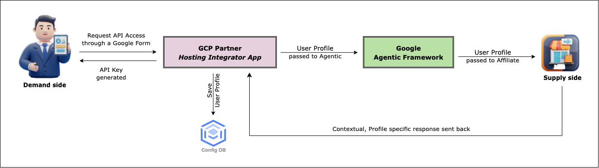

- Affiliate requests API Access to the hosting partner of the *Integrator App*
- A Google Form link is sent to the Affiliate by GCP partner hosting the *Integrator App*
- Affiliate fills up the form with details of *User Profile* information to be sent to Agentic framework
  - Fields to be sent to Agentic - **City, Mobile No., Email, Latitude, Longitude, Zip code** are mandatory fields
  - Any other fields that Affiliate wants to send to the Agentic framework

- The fields are kept as a configuration parameters by *Integrator App*, mangled by GCP partner hosting the *Integrator App*
- An API Key is generated for the Affiliate and sent back to them
- API spec is shared with the Affiliate

### What happens next?

- Affiliate adds an UI Element in their existing Mobile or Web App

- The UI Element should have an action to call the **Search** API exposed by the *Integrator App*

  > [!NOTE]
  >
  > - There is one and only one API to be consumed - a **Search** API call to the *Integrator App*
  > - This API flows through the layers of Agentic framework and performs the desired action(s)
  > - All User Profile information as decided with Demand Affiliate are sent with the API call

- *Integrator App* is launched with its default UI and Agentic framework integrated

- From now on, all user intents (*Text or Voice commands*) are sent to the *Integrator App* which in turn calls the Agentic framework.

- The information reaches the Supply-side affiliates; which then returns appropriate content back to the Affiliate's app

> [!NOTE]
>
> ### What is so special about the returned Content?
>
> - Content is not *User Action* driven but **User Intent** driven
> - *User Actions* are characterised traditionally by actions on various UI elements like Menu items, Buttons etc.; whereas **User Intents** are initiated by Natural Language Processing (*NLP*) i.e. inferencing from *Text* or *Voice* commands
>   - Inference can relate to a direct action like fetching content from a specific provider
>     - *I want to buy a sunglasses of XXX brand*
>   - Inference can relate to a set of indirect actions
>     - *Please plan my holiday this summer  to XXX location*
>     - *I would like to celebrate my 20th b'day with a small group of friends. Please suggest!*
>       - Fetching contents from multiple providers
>       - Suggesting Alternative actions Or Follow up questions
>       - Generating contents matching the user's intents
>       - And a combination of all above; which translates into an end to end *action planner*


## Supply-side Affiliates

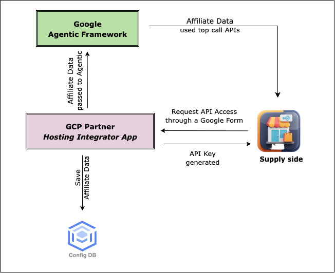

- Affiliate requests API Access to the hosting partner of the *Integrator App*

- Affiliate is sent the API Spec to be hosted by Affiliate

  > [!Note]
  >
  > - Only one API - **Search**
  > - Affiliate can decide to host it as Synchronous or Asynchronous mode
  > - Agentic framework will call this API based on User's intent (*Text* or *Voice* commands)

- A Google Form link is sent to the Affiliate by GCP partner hosting the *Integrator App*

- Affiliate fills up the form with the API details 

  - API Url
  - Response body
    - This should match the API Spec shared by the hosting partner of the *Integrator App*

- An API Key is generated for the Affiliate and sent back to them

- An optional  *Callback URL* is sent to the Affiliate for calling this to complete any transaction - payment or form submission etc.

# Points to Note

> [!Note]
>
> - **Google Agentic framework**
>   - Understands user’s intent from Text or Voice
>   - Break that into Actionable insights
>   - Route requests to appropriate Affiliates and/or Content Providers(*Outside Network*)
> - ***Integrator App*** will be responsible for managing the configuration points for both Demand and Supply side of this application flow.
>   - **Demand side**
>     - The configuration options for Buyers and Seekers would be managed by Integrator App in its own database
>     - Preferred Networks - Preferred target networks to connect from **Google Agentic framework**
>     - Intended Verticals - Preferred Verticals to support by **Google Agentic framework**
>     - Maintain API security by creating and managing API key which needs to be sent through API header
>   - **Supply Side**
>     - Maintain a list of default Affiliates and Content Providers(*Outside Network*)
>     - Log all transactions in an Audit DB
>
> - Implement Basic Analytics
> - Implement Advanced Analytics (*Future*)
>
> Is **Google Agentic framework** completely **Stateless**?
>
> - Current implementation is Stateless with a only light-weight *Semantic* memory history for agents
> - **Future Plans**
>   - Add various different types of memories - *Episodic, Procedural* etc. to respond with better context and past actions by end user(s)
>   - Add **Emotions** into each *Sub-agent* and respond with more empathy and care
>   - Enable an intense search capability within a specific and selected set of contents - documents, videos, images etc.
>   - Respond with a more detailed, generated content based on various user parameters like - *profile, context, sentiments* etc.

# Sequential Flow

## Affiliate Networks


- These are Supply side **Partners** or **Affiliates**

- They have their own Buyer Apps to fetch data from various Open Networks like ONDC

  - They need to follow the API specs provided by **Google Agentic framework** to integrate into the system. Agentic framework will call the APIs exposed by Affiliates to fetch their contents
  - Visibility of their data depends on getting more Buyers registering onto their system
  - Separate Buyer Apps needed for separate Networks like *Retail, Agri* etc.
  - Building an aggregator platform themselves need more effort and visibility would still be an issue; to bring more Buyers across segments onto their platform
  - Examples
    - Retail Buyer Apps or Seller Apps
    - Various Service providers
    - Loan or Credit providers

- **Google Agentic framework** increases visibility of their data by exposing it to multiple Demand side Affiliates who might not event be on any Open Network

  - These Demand side affiliates can simply integrate with Agentic framework (*along with a conversational UI*) and launch from their existing apps or websites

  - This way the users of these Demand side affiliates can reach to multiple Supply side affiliates 

  - At the same time, each Supply side affiliate is exposed to multiple Demand side affiliates and their end users immediately

  - Example

    - Banks, Insurance agencies
    - Travel & Tourism agencies 
    - Jobs' and Skilling sites
    - Media platforms

    

## Integrator Networks (*Outside Open Network*)


- These are Partners or Integrators who has publicly exposed APIs to share their contents
- **Google Agentic framework** calls these APIs directly and send the contents to the Integrator App asynchronously
- Examples
  - YouTube and other Video content providers
  - Weather data providers
  - Mandi price providers

# Component View

## What are the components?

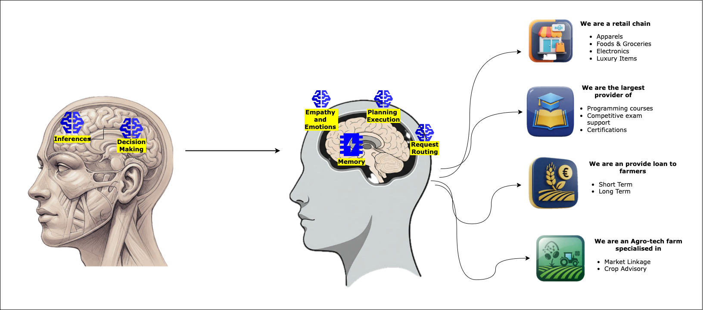

- **Master Agent**

  - The first responder to all incoming requests
  - Connects to a fine-tuned Gemini model for inferencing
  - Responses from Model will return a specific formatted JSON with **Specific Intents** (*which network to go to?*); **Action items** (*Search*) and **Messages** *(corresponding data points to send to the Open Network*)
  - Passes the JSON to Platform specific **Sub-Agents**

- **Sub-agent**

  - Acts like an independent unit capable to communicate with a specific Affiliate Networks and for a specific domain

  - Request from **Master-agent** is processed to convert it into a request for a specific Affiliate Network
  - Sends the request to corresponding Adapter to get contents from Affiliate Networks based on the intent from **Master Agent**
  - Based on the on the intent from **Master Agent** can also connect with one or more other **Sub Agent(s)** to fulfil a task. These are called **Planner Agents**
  - Each **Sub Agent** has a small *memory cache*
  - Each **Sub Agent** has a some characteristics similar to human brain to curate the response based on intent from **Master Agent** viz. *Empathy & Emotions*, *Logical Decision Making* etc.

- **Adapters**

  - Connects **Sub-Agents** to the Affiliate Networks
  - Sends the request to Affiliate Networks e.g. ONEST (for *Education, Jobs, Skilling*) or ONDC (for *Retail*) etc. or Content providers like Youtube


## Let us deep-dive into these components

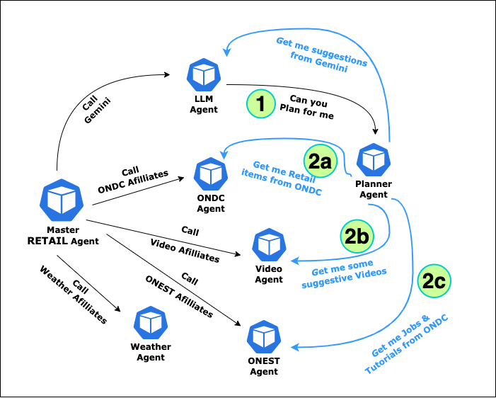


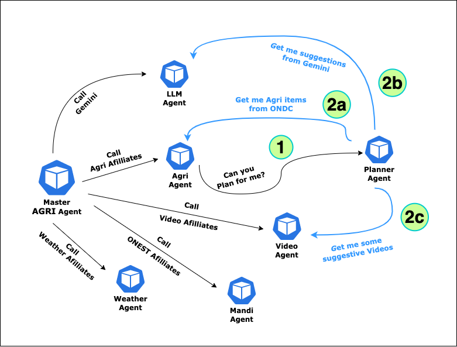


## Agents

### Master

##### master-agent

**Relative Path**: backend/aggregators/agents/master

| Function          | Description                                                  | URL path | Http(s) |
| ----------------- | ------------------------------------------------------------ | -------- | ------- |
| Health Check      | Returns 200 OK<br />Health API for the microservice; can be LBs/Gateways while checking the backend health status | /healthz | GET     |
| Search for Intent | Determines user's intent through a fine tuned Gemini-based model<br/>Calls Search API of the corresponding Agent based on the intent | /search  | POST    |


### ONDC

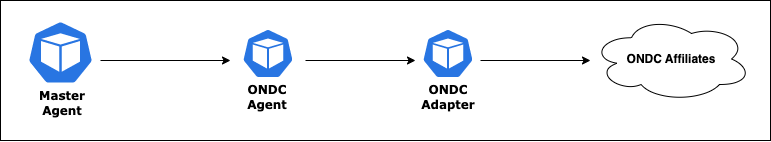


##### ondc-agent

**Relative Path**: backend/aggregators/agents/networks/ondc

| Function                             | Description                                             | URL path | Http(s) |
| ------------------------------------ | ------------------------------------------------------- | -------- | ------- |
| Search for Content from ONDC network | Calls Search API of the [Buyer Adapter](#buyer-adapter) | /search  | POST    |


### ONEST

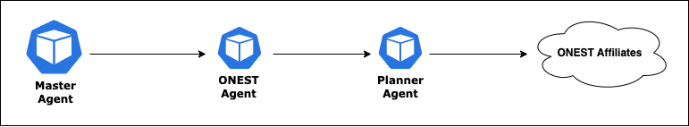


##### onest-agent

**Relative Path**: backend/aggregators/agents/networks/onest

| Function                              | Description                                             | URL path | Http(s) |
| ------------------------------------- | ------------------------------------------------------- | -------- | ------- |
| Search for Content from ONEST network | Calls Search API of the [Planner Agent](#planner-agent) | /search  | POST    |


### Agri

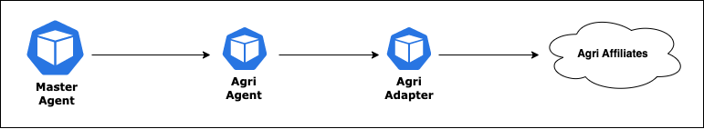


##### agri-agent

**Relative Path**: backend/aggregators/agents/networks/agri

| Function                                  | Description                                                  | URL path | Http(s) |
| ----------------------------------------- | ------------------------------------------------------------ | -------- | ------- |
| Search for Content from various providers | Calls Search API of the either the [Planner Agent](#planner-agent) or the [Agri Adapter](#agri-adapter) based on the intent from the **Master Agent** | /search  | POST    |


### LLM

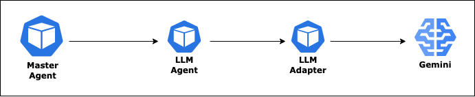


##### llm-agent

**Relative Path**: backend/aggregators/agents/integrators/llm

| Function                                       | Description                                                  | URL path            | Http(s) |
| ---------------------------------------------- | ------------------------------------------------------------ | ------------------- | ------- |
| Search for suggestive Content<br />from Gemini | Calls Search API of the  [LLM Adapter](#llm-adapter).<br />Request Param:<br />**isAbusive** = true, false | /search/:isAbusive? | POST    |
| Search for Content from<br />various providers | Calls Search API of the [Planner Agent](#planner-agent)      | /planner/search     | POST    |


### Video

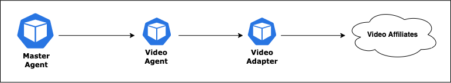


##### video-agent

**Relative Path**: backend/aggregators/agents/integrators/video

| Function                                        | Description                                                  | URL path | Http(s) |
| ----------------------------------------------- | ------------------------------------------------------------ | -------- | ------- |
| Search for Video content from various providers | Calls Search API of the either the [Video Adapter](#video-adapter) | /search  | POST    |


### Mandi

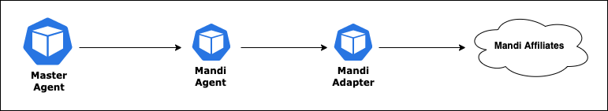


##### mandi-agent

**Relative Path**: backend/aggregators/agents/integrators/mandi

| Function                                                    | Description                                                  | URL path | Http(s) |
| ----------------------------------------------------------- | ------------------------------------------------------------ | -------- | ------- |
| Search for Mandi prices from<br />various service providers | Calls Search API of the either the [Mandi Adapter](#mandi-adapter) | /search  | POST    |


### Weather

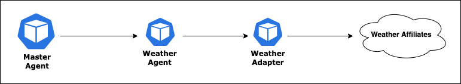


##### weather-agent

**Relative Path**: backend/aggregators/agents/integrators/weather

| Function                                                     | Description                                                  | URL path | Http(s) |
| ------------------------------------------------------------ | ------------------------------------------------------------ | -------- | ------- |
| Search for Weather information from<br />various service providers | Calls Search API of the either the [Weather Adapter](#weather-adapter) | /search  | POST    |


### Planner

##### planner-agent

**Relative Path**: backend/aggregators/agents/integrators/planner

| Function                                                     | Description                                                  | URL path            | Http(s) |
| ------------------------------------------------------------ | ------------------------------------------------------------ | ------------------- | ------- |
| Search for Content from various providers                    | Calls Search API of either the [ONDC Agent](#ondc-agent), the [Video Agent](#video-agent) or [LLM Agent](#llm-agent) based on the intent from the **Master Agent** | /multi/ondc/search  | POST    |
| Search for Content from various providers                    | Calls Search API of either the [Video Agent](#video-agent) or [LLM Agent](#llm-agent)  based on the intent from the **Master Agent** | /multi/onest/search | POST    |
| Search for Agriculture Content from ONDC network<br />(*Agri Commerce*) | Calls Search API of the [ONDC Agent](#ondc-agent)            | /agri/ondc/search   | POST    |
| Search for Retail Content from ONDC network<br />(*Retail Commerce*) | Calls Search API of the [LLM Agent](#llm-agent)              | /agri/search        | POST    |

> [!Note]
>
> **Agri Commerce**
>
> This is primarily to help **Agri** users to search and perform transactions for various Agri commerce products viz.
>
> - Pesticides
> - Fertilisers
> - Various types of Seeds
> - ..... (more)
>
> **Retail Commerce** for Agri users
>
> - This is case when **Agri** users to search for various Non-Agri commerce products or any Retail products
> - Agri model will NOT allow any transaction or search for Retail products by Agri users
> - All such Retail queries will be routed to the LLM agent to provide more suggestive responses through Gemini and guide users with multiple alternative options
>
> **Retail Commerce** for Retail users
>
> - This is primarily to help **Retail** users to search and perform transactions for various Retail products
> - The request will be routed to the designated affiliates to return appropriate content and allow users to search and complete transaction


## Adapters

### Buyer


##### buyer-adapter

**Relative Path**: backend/aggregators/adapters/buyer

| Function                             | Description                                           | URL path | Http(s) |
| ------------------------------------ | ----------------------------------------------------- | -------- | ------- |
| Search for Content from ONDC network | Calls Search API of the ONDC Affiliates or Buyer Apps | /search  | POST    |


### Agri


##### agri-adapter

**Relative Path**: backend/aggregators/adapters/agri

| Function                                                 | Description                                                  | URL path               | Http(s) |
| -------------------------------------------------------- | ------------------------------------------------------------ | ---------------------- | ------- |
| Search for Loan options from various providers           | Calls Search API of the Agri Affiliates providing Loan options | /loan/search           | POST    |
| Search for Market-linkage options from various providers | Calls Search API of the Agri Affiliates providing market linkage options allowing selling of Agri products | /market-linkage/search | POST    |


### LLM


##### llm-adapter

**Relative Path**: backend/aggregators/adapters/llm

| Function                                  | Description                                  | URL path  | Http(s) |
| ----------------------------------------- | -------------------------------------------- | --------- | ------- |
| Search for suggestive Content from Gemini | Calls Gemini api for LLM chat with streaming | /llm/chat | POST    |


### Video


##### video-adapter

**Relative Path**: backend/aggregators/adapters/video

| Function                                         | Description                                                  | URL path        | Http(s) |
| ------------------------------------------------ | ------------------------------------------------------------ | --------------- | ------- |
| Search for Video content from Youtube            | Calls Youtube Data API for appropriate contents with semantic search | /videos/youtube | POST    |
| Search for Video content from various Affiliates | Calls Search API of the various Video provider Affiliates    | /videos/partner | POST    |


### Mandi


##### mandi-adapter

**Relative Path**: backend/aggregators/adapters/mandi

| Function                                        | Description                                                  | URL path       | Http(s) |
| ----------------------------------------------- | ------------------------------------------------------------ | -------------- | ------- |
| Search for Mandi prices from<br />ENAM          | Calls Mandi pricing API of ENAM                              | /mandi/enam    | POST    |
| Search for Mandi prices from various Affiliates | Calls Search API of the various Mandi price provider Affiliates | /mandi/partner | POST    |


### Weather


##### weather-adapter

**Relative Path**: backend/aggregators/adapters/weather

| Function                                           | Description                                                  | URL path             | Http(s) |
| -------------------------------------------------- | ------------------------------------------------------------ | -------------------- | ------- |
| Search for Weather information from OpenWeatherMap | Calls OpenWeatherMap API for current weather reports         | /weather/openweather | POST    |
| Search for Weather information various Affiliates  | Calls Search API of the various Weather service provider Affiliates | /weather/partner     | POST    |

> [!NOTE]
>
> Content Providers are divided into two categories:
>
> - **Affiliates**
>
>   - Partners who agree to implement the Search API(s) as per the specifications by **Google Agentic framework**
>
>   - They host the **Search API** on their environment and expose it for the framework to consume
>
>   - These providers are optional and can come by default with the framework; Or Demand side affiliates can decide to replace the provider by their own affiliates
>
>     
>
> - **Publicly available Providers**
>
>   - The Content providers has APIs exposed to be consumed publicly
>   - **Google Agentic framework** call those APIs to get appropriate content
>   - These providers come by default with the framework


# API Specifications

## Authentication

- The initial version proposes to use Key based security for APIs

- Key to be created and managed by Integrator app

- Key to be passed in the **X-API-<affiliate>-Key** header with each API call

- Multiple Open network API might have their own version of api keys which the Demand side has to send while calling Master Agent API as explained below

  

| Key                       | Value                       |
| ------------------------- | --------------------------- |
| x-api-video-key           | [YouTube Api key]           |
| x-api-weather-key         | [OpenWeatherMap Api key]    |
| x-partner-api-weather-key | [Weather Affiliate Api Key] |
| x-api-mandi-key           | [ENAM Mandi Api Key]        |
| x-partner-api-mandi-key   | [Mandi Affiliate Api Key]   |


# [Master Agent](#master-agent)


- Api for [Demand-side affiliates](#Demand-side Affiliates) to integrate with the **Google Agentic framework**
- This api is hosted by **Google Agentic framework** and exposed to the Demand side of the Network - Buyers and Seekers
- Any Mobile or Web app integrating with this framework will call this single API to receive content as per Buyers request


## Async Mode

### Request

#### /search

```yaml
openapi: 3.0.0
info:
  title: Google Agentic Core API
  description: Google Agentic Core API specification
  version: 0.0.1

security:
- ApiKeyAuth: []  
paths:
  /search:
    post:
      tags:
      - Domain spaecific search
      - Google Agentic framework
      - Master Agent
      description: Master Agent of the Google Agentic framework to transform text query into actionable insights
      requestBody:
        description: Search service by Google Agentic framework.
        content:
          application/json:
            schema:
              type: object
              properties:                
                transaction_id:
                  type: string
                message_id:
                  type: string
                query:
                  type: string
                location:
                  type: object
                  description: Contains location details of the user (*Mobile Device or Web*).
                  properties:
                    mob:
                      type: string
                    city:
                      type: string
                    name:
                      type: string
                    email:
                      type: string
                    lat:
                      type: string
                    lng:
                      type: string
                    zip:
                      type: string
                preferred_networks:
                  type: object
                  description: Contains a list of target Affilaites and/or Content providers.|
                    Google Agentic framework will route requests appropriately to these networks.
                  properties:                    
                    $ref: '#/components/schemas/PreferredNetwork'                  
              required:
              - transaction_id
              - message_id
              - query
              - preferred_networks
      responses:
        '200':
          description: Acknowledgement of message received.
          content:
            application/json:
              schema:
                type: object
                properties:
                  message:
                    type: object
                    properties:
                      ack:
                        $ref: '#/components/schemas/Ack'
                    required:
                    - ack
                  error:
                    $ref: '#/components/schemas/Error'
                required:
                - message
```


### Response

```yaml
Ack:
  description: Describes the ACK response.
  type: object
  properties:
    status:
      type: string
      description: If schema validation passes, status is ACK else it is NACK.
      enum:
      - ACK
      - NACK
  required:
  - status
```

```yaml
Error:
  description: Describes an error object
  type: object
  properties:
    type:
      type: string
      enum:
        - CONTEXT_ERROR
        - CORE_ERROR
        - DOMAIN_ERROR            
        - JSON_SCHEMA_ERROR
    code:
      type: string
      description: Error code from a list of error codes from Google Agentic framework.
    path:
      type: string
      description: Path to json schema generating the error during json schema validation.
    message:
      type: string
      description: Human readable message describing the error.
  required:
  - type
  - code
```


# Affiliate APIs 

This API will be hosted by the Supply side of the Network - Buyer Apps and Seeker Apps on the ONDC network.

- Buyer Apps and Seeker Apps would bring content from Sellers on the Network
- Communication between Buyer/Seekers and Sellers/Providers would be strictly beckon protocol
  - Although the **Google Agentic framework** does not enforce any restriction on the same; but is strongly expected.
- Modes
  - **Asynchronous Mode**
    - ONDC Sub-agents calls **/search** API hosted by Affiliates
    - Affiliates return search content by **callback_url** hosted by **Google Agentic framework**
    - Framework return the search results back to the Demand side - Buyers and Seekers through a Websocket connection
  - **Synchronous Mode**
    - ONDC Sub-agents calls **/search** API hosted by Affiliates
    - Wait for the Affiliates to return the search result. **callback_url** is ignored by Affiliates in this case
    - Framework return the search results back to the Demand side - Buyers and Seekers through a Websocket connection

## Async Mode

### /search

```yaml
openapi: 3.0.0
info:
  title: Google Agentic Core API
  description: Google Agentic Core API specification
  version: 0.0.1

security:
- ApiKeyAuth: []  
paths:
  /search:
    post:
      tags:
      - Domain spaecific search
      - Google Agentic framework
      - Open Networks      
      description: Domain spaecific search by Google Agentic framework in the Open Networks.
      requestBody:
        description: Search service by Google Agentic framework.
        content:
          application/json:
            schema:
              type: object
              properties:
                context:
                  $ref: '#/components/schemas/Context'
                message:
                  type: object
                  properties:
                    network:
                      $ref: '#/components/schemas/Network'
              required:
              - context
              - message
      responses:
        '200':
          description: Acknowledgement of message received.
          content:
            application/json:
              schema:
                type: object
                properties:
                  message:
                    type: object
                    properties:
                      ack:
                        $ref: '#/components/schemas/Ack'
                    required:
                    - ack
                  error:
                    $ref: '#/components/schemas/Error'
                required:
                - message
```

### ack

```yaml
Ack:
  description: Describes the ACK response.
  type: object
  properties:
    status:
      type: string
      description: If schema validation passes, status is ACK else it is NACK.
      enum:
      - ACK
      - NACK
  required:
  - status
```

### error

```yaml
Error:
  description: Describes an error object
  type: object
  properties:
    type:
      type: string
      enum:
        - CONTEXT_ERROR
        - CORE_ERROR
        - DOMAIN_ERROR            
        - JSON_SCHEMA_ERROR
    code:
      type: string
      description: Error code from a list of error codes from Google Agentic framework.
    path:
      type: string
      description: Path to json schema generating the error during json schema validation.
    message:
      type: string
      description: Human readable message describing the error.
  required:
  - type
  - code
```


### /on_search

#### context

```yaml
Context:
  description: Describes a message context. This is primarily used internally by the framework.|
    Affiliates are expected to send this as-is in their response to the search() request.
  type: object
  properties:
    domain:
      $ref: '#/components/schemas/Domain'
    location:
      type: object
      description: Contains location details of the user (*Mobile Device or Web*).
      properties:
        mob:
          type: string
        city:
          type: string
        name:
          type: string
        email:
          type: string
        lat:
          type: string
        lng:
          type: string
        zip:
          type: string      
    version:
      type: string
      description: Version of Google Agentic framework API specification.
    transaction_id:
      type: string
      description: This is a unique value which persists across all API calls.
    message_id:
      type: string
      description: This is a unique value which persists during a request / callback cycle.
    timestamp:
      type: string
      format: date-time
      description: Time of request generation in RFC3339 format.
    callback_url:
      type: string          
      description: URL to be called by Affilaites in response to the search() function call.|
        This is used only if Affiliates want to be send data Synchronously.
  required:
  - domain
  - location
  - transaction_id
  - message_id
  - timestamp

  Domain:
  type: string
  description: Describes the domain or network name used in the transaction.|
    e.g. domain:ONDC, domain:ONEST
```

#### message

```yaml
message:
  type: object
  properties:
    catalog:
      $ref: '#/components/schemas/Catalog'
    network:
      $ref: '#/components/schemas/Network'
    next_page_token:
      type: string                    
  required:
  - catalog
  - network
```

##### catalog

```yaml
Catalog:
  description: Item containing Search response from the Affiliates or Content providers.
  type: object
  properties:
    descriptor:
      type: object
      properties:
        name:
          type: string
    provider:
      type: object
      properties:
        descriptor:
          type: object
          properties:
            name:
              type: string
        embedding_url:
          type: string
        items:
          type: array          
          description: And array of JSON objects containing products from Affiliates.
      required:
      - descriptor
      - embedding_url
    required:
    - descriptor
    - provider
```

##### network

```yaml
Network:      
  type: object
  description: Describes details of the target network.
  properties:
    name:
      type: string
      enum:
      - ONDC          
    action:
      type: string
    relevant_text:
      type: string
    filters:
      type: array      
      description: An array of string or JSON objects to help Affiliates perform Search filtering
  required:
  - name
  - action
  - relevant_text
  - filters
```

> [!Note]
>
> **catalog.provider.items**
>
> Currently this is a list of JSON objects if any type as different Affiliates has different product structure. This means every time a new Affiliates is added, the Integrator app has to change their UI with new set of fields.
>
> In future, pan is to standardise the items array with common set of JSON objects which every Affiliate has to send. That would make the UI integration seamless.


## Video

### /search

```yaml
openapi: 3.0.0
info:
  title: Google Agentic Core API
  description: Google Agentic Core API specification
  version: 0.0.1

security:
- ApiKeyAuth: []  
paths:
  /search:
    post:
      tags:
      - Domain spaecific search
      - Google Agentic framework
      - Video, Webcast, Podcasts
      description: Domain spaecific search by Google Agentic framework from various Content Providers |
        outside the Open Networks - Videos, Webcasts, Podcasts
      requestBody:
        description: Search service by Google Agentic framework.
        content:
          application/json:
            schema:
              type: object
              properties:
                context:
                  $ref: '#/components/schemas/Context'
                message:
                  type: object
                  properties:
                    network:
                      $ref: '#/components/schemas/Network'
              required:
              - context
              - message
      responses:
        '200':
          description: Acknowledgement of message received.
          content:
            application/json:
              schema:
                type: object
                properties:
                  message:
                    type: object
                    properties:
                      ack:
                        $ref: '#/components/schemas/Ack'
                    required:
                    - ack
                  error:
                    $ref: '#/components/schemas/Error'
                required:
                - message
```

### [ack](#ack)

### [error](#error)


### /on_search

#### context

```yaml
Context:
  description: Describes a message context. This is primarily used internally by the framework.|
    Affiliates are expected to send this as-is in their response to the search() request.
  type: object
  properties:
    domain:
      $ref: '#/components/schemas/Domain'
    location:
      type: object
      description: Contains location details of the user (*Mobile Device or Web*).
      properties:
        mob:
          type: string
        city:
          type: string
        name:
          type: string
        email:
          type: string
        lat:
          type: string
        lng:
          type: string
        zip:
          type: string      
    version:
      type: string
      description: Version of Google Agentic framework API specification.
    transaction_id:
      type: string
      description: This is a unique value which persists across all API calls.
    message_id:
      type: string
      description: This is a unique value which persists during a request / callback cycle.
    timestamp:
      type: string
      format: date-time
      description: Time of request generation in RFC3339 format.
    callback_url:
      type: string          
      description: URL to be called by Affilaites in response to the search() function call.|
        This is used only if Affiliates want to be send data Synchronously.
  required:
  - domain
  - location
  - transaction_id
  - message_id
  - timestamp

  Domain:
  type: string
  description: Describes the domain or network name used in the transaction.|
    e.g. domain:VIDEO
```

#### message

```yaml
message:
  type: object
  properties:
    catalog:
      $ref: '#/components/schemas/Catalog'
    network:
      $ref: '#/components/schemas/Network'
    next_page_token:
      type: string                    
  required:
  - catalog
  - network
```

##### catalog

```yaml
Catalog:
  description: Item containing Search response from the Affiliates or Content providers.
  type: object
  properties:
    descriptor:
      type: object
      properties:
        name:
          type: string
    provider:
      type: object
      properties:
        descriptor:
          type: object
          properties:
            name:
              type: string            
        items:
          type: array          
          description: And array of JSON objects containing products from Affiliates.
      required:
      - descriptor          
    required:
    - descriptor
    - provider
```

##### network

```yaml
Network:      
  type: object
  description: Describes details of the target network.
  properties:
    name:
      type: string
      enum:
      - VIDEO          
    action:
      type: string
    relevant_text:
      type: string
    filters:
      type: array      
      description: An array of string or JSON objects to help Affiliates perform Search filtering
  required:
  - name
  - action
  - relevant_text
  - filters 
```


## Mandi

### /search

```yaml
openapi: 3.0.0
info:
  title: Google Agentic Core API
  description: Google Agentic Core API specification
  version: 0.0.1

security:
- ApiKeyAuth: []  
paths:
  /search:
    post:
      tags:
      - Domain spaecific search
      - Google Agentic framework
      - Mandi, ENAM, Pricing
      description: Domain spaecific search by Google Agentic framework from various Content Providers |
        outside the Open Networks - Mandi, ENAM
      requestBody:
        description: Search service by Google Agentic framework.
        content:
          application/json:
            schema:
              type: object
              properties:
                context:
                  $ref: '#/components/schemas/Context'
                message:
                  type: object
                  properties:
                    network:
                      $ref: '#/components/schemas/Network'
              required:
              - context
              - message
      responses:
        '200':
          description: Acknowledgement of message received.
          content:
            application/json:
              schema:
                type: object
                properties:
                  message:
                    type: object
                    properties:
                      ack:
                        $ref: '#/components/schemas/Ack'
                    required:
                    - ack
                  error:
                    $ref: '#/components/schemas/Error'
                required:
                - message
```

### [ack](#ack)

### [error](#error)


### /on_search

#### context

```yaml
Context:
  description: Describes a message context. This is primarily used internally by the framework.|
    Affiliates are expected to send this as-is in their response to the search() request.
  type: object
  properties:
    domain:
      $ref: '#/components/schemas/Domain'
    location:
      type: object
      description: Contains location details of the user (*Mobile Device or Web*).
      properties:
        mob:
          type: string
        city:
          type: string
        name:
          type: string
        email:
          type: string
        lat:
          type: string
        lng:
          type: string
        zip:
          type: string      
    version:
      type: string
      description: Version of Google Agentic framework API specification.
    transaction_id:
      type: string
      description: This is a unique value which persists across all API calls.
    message_id:
      type: string
      description: This is a unique value which persists during a request / callback cycle.
    timestamp:
      type: string
      format: date-time
      description: Time of request generation in RFC3339 format.
    callback_url:
      type: string          
      description: URL to be called by Affilaites in response to the search() function call.|
        This is used only if Affiliates want to be send data Synchronously.
  required:
  - domain
  - location
  - transaction_id
  - message_id
  - timestamp

  Domain:
  type: string
  description: Describes the domain or network name used in the transaction.|
    e.g. domain:ENAM
```

#### message

```yaml
message:
  type: object
  properties:
    catalog:
      $ref: '#/components/schemas/Catalog'
    network:
      $ref: '#/components/schemas/Network'
    next_page_token:
      type: string                    
  required:
  - catalog
  - network
```

##### catalog

```yaml
Catalog:
  description: Item containing Search response from the Affiliates or Content providers.
  type: object
  properties:
    descriptor:
      type: object
      properties:
        name:
          type: string
    provider:
      type: object
      properties:
        descriptor:
          type: object
          properties:
            name:
              type: string            
        items:
          type: array          
          description: And array of JSON objects containing products from Affiliates.
      required:
      - descriptor          
    required:
    - descriptor
    - provider
```

##### network

```yaml
Network:      
  type: object
  description: Describes details of the target network.
  properties:
    name:
      type: string
      enum:
      - ENAM          
    action:
      type: string
    relevant_text:
      type: string
    filters:
      type: array      
      description: An array of string or JSON objects to help Affiliates perform Search filtering
  required:
  - name
  - action
  - relevant_text
  - filters
```


## Weather

### /search

```yaml
openapi: 3.0.0
info:
  title: Google Agentic Core API
  description: Google Agentic Core API specification
  version: 0.0.1

security:
- ApiKeyAuth: []  
paths:
  /search:
    post:
      tags:
      - Domain spaecific search
      - Google Agentic framework
      - Weather, OpenWeatherMap
      description: Domain spaecific search by Google Agentic framework |
      from various Weather data providers.
      requestBody:
        description: Search service by Google Agentic framework.
        content:
          application/json:
            schema:
              type: object
              properties:
                context:
                  $ref: '#/components/schemas/Context'
                message:
                  type: object
                  properties:
                    network:
                      $ref: '#/components/schemas/Network'
              required:
              - context
              - message
      responses:
        '200':
          description: Acknowledgement of message received.
          content:
            application/json:
              schema:
                type: object
                properties:
                  message:
                    type: object
                    properties:
                      ack:
                        $ref: '#/components/schemas/Ack'
                    required:
                    - ack
                  error:
                    $ref: '#/components/schemas/Error'
                required:
                - message
```

### [ack](#ack)

### [error](#error)


### /on_search

#### context

```yaml
Context:
  description: Describes a message context. This is primarily used internally by the framework.|
    Affiliates are expected to send this as-is in their response to the search() request.
  type: object
  properties:
    domain:
      $ref: '#/components/schemas/Domain'
    location:
      type: object
      description: Contains location details of the user (*Mobile Device or Web*).
      properties:
        mob:
          type: string
        city:
          type: string
        name:
          type: string
        email:
          type: string
        lat:
          type: string
        lng:
          type: string
        zip:
          type: string      
    version:
      type: string
      description: Version of Google Agentic framework API specification.
    transaction_id:
      type: string
      description: This is a unique value which persists across all API calls.
    message_id:
      type: string
      description: This is a unique value which persists during a request / callback cycle.
    timestamp:
      type: string
      format: date-time
      description: Time of request generation in RFC3339 format.
    callback_url:
      type: string          
      description: URL to be called by Affilaites in response to the search() function call.|
        This is used only if Affiliates want to be send data Synchronously.
  required:
  - domain
  - location
  - transaction_id
  - message_id
  - timestamp

  Domain:
  type: string
  description: Describes the domain or network name used in the transaction.|
    e.g. domain:WEATHER
```

#### message

```yaml
message:
  type: object
  properties:
    catalog:
      $ref: '#/components/schemas/Catalog'
    network:
      $ref: '#/components/schemas/Network'
    next_page_token:
      type: string                    
  required:
  - catalog
  - network
```

##### catalog

```yaml
Catalog:
  description: Item containing Search response from the Affiliates or Content providers.
  type: object
  properties:
    descriptor:
      type: object
      properties:
        name:
          type: string
    provider:
      type: object
      properties:
        descriptor:
          type: object
          properties:
            name:
              type: string            
        items:
          type: array          
          description: And array of JSON objects containing products from Affiliates.
      required:
      - descriptor          
    required:
    - descriptor
    - provider
```

##### network

```yaml
Network:      
  type: object
  description: Describes details of the target network.
  properties:
    name:
      type: string
      enum:
      - WEATHER          
    action:
      type: string
    relevant_text:
      type: string
    filters:
      type: array      
      description: An array of string or JSON objects to help Affiliates perform Search filtering
  required:
  - name
  - action
  - relevant_text
  - filters   
```


## Order Placement

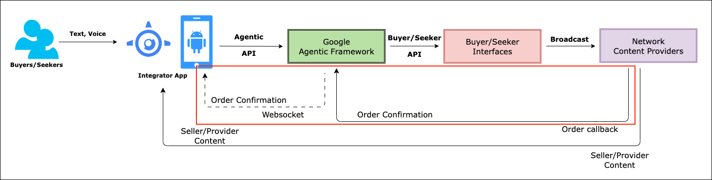

How can Agentic framework integrate Order placement flow and the subsequent payment?

- This is primarily done by Integrator or hosting app with Agentic facilitating the integration
- Integrator app Searches for an item
- Each search result contains an embedded url for that particular product
- Integrator app launches an embedded Webview to show the product details within Webview/IFrame
- Add-to-Cart and Check-out happens through the embedded webview
- Once Order is placed, Integrator app receives Order confirmation response along with details Order Info as JSON object


## Launch Webview

```bash
https://<Base-url-of-the-provider>?trid=<transaction_id>&msgid=<message_id>&actid=<action_id>&mob=<mobile_no>&zip=<zip_code>&cb=<payment_callback>
```

## Order Response

```JSON
{
    context:
    {
        transaction_id: <tr_id>,
        message_id: <msg_id>,
        action_id: <act_id>        
    },
    message:
    {
        orders:
        [{
            <order_info> object
            // structure will be decided and sent by Mystore
            // Integrator app will store this json as-is in the transaction log db    
           
        }]
    }  
}
```

# Points to Note

> - **Google Agentic framework**
>   - Understands user’s intent from Text or Voice
>   - Break that into Actionable insights
>   - Route requests to appropriate Affiliates and/or Content Providers(*Outside Network*)
> - [Integrator App](#Integrator App) will be responsible for managing the configuration points for both Demand and Supply side of this application flow.
>   - **Demand side**
>     - The configuration options for Buyers and Seekers would be managed by Integrator App in its own database
>     - Preferred Networks - Preferred target networks to connect from **Google Agentic framework**
>     - Intended Verticals - Preferred Verticals to support by **Google Agentic framework**
>     - Maintain API security by creating and managing API key which needs to be sent through API header
>  - **Supply Side**
>     - Maintain a list of default Affiliates and Content Providers(*Outside Network*)
>     - Log all transactions in an Audit DB
>   - Implement Basic Analytics
>  - Implement Advanced Analytics (*Future*)
>   


## How does it all look like?

### Retail

### Dashboard

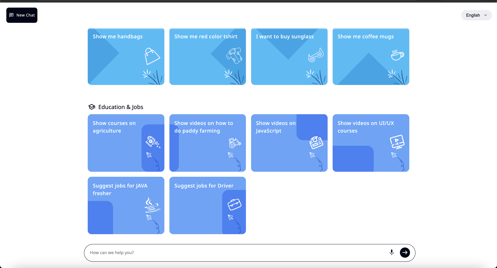


- **Intent**: Show me Handbags
- **Response**: Handbags from ONDC network by various Affiliates

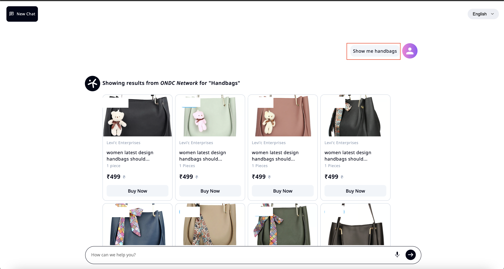

- **Intent**: Show me Sunglasses from Rayban
- **Response**: Sunglasses from ONDC network by various Affiliates

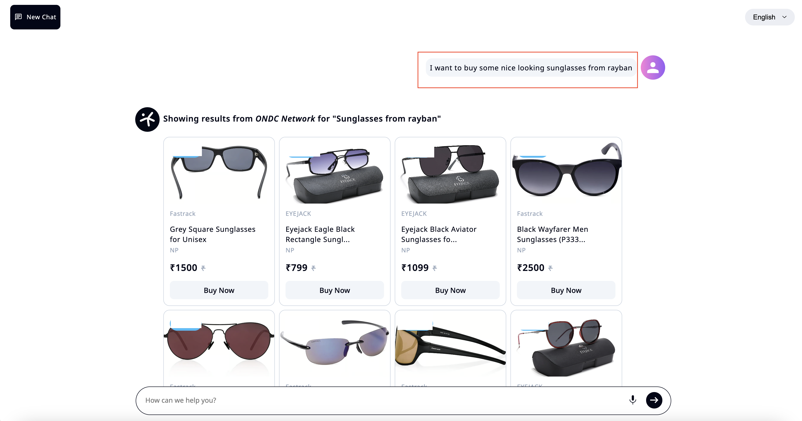

- **Intent**: Plan my daughter's marriage ceremony
- **Response**: Planner from multiple Affiliates - ONDC, Youtube Videos and a from Gemini LLM

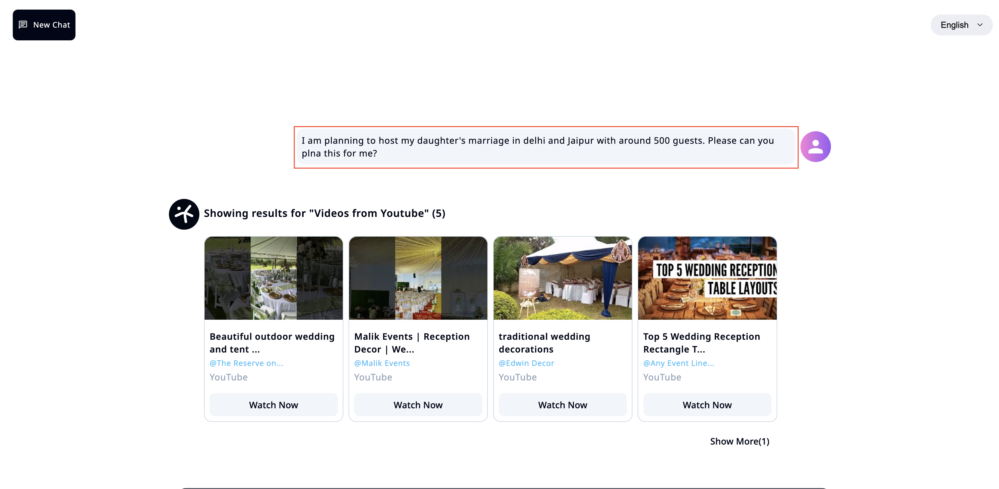

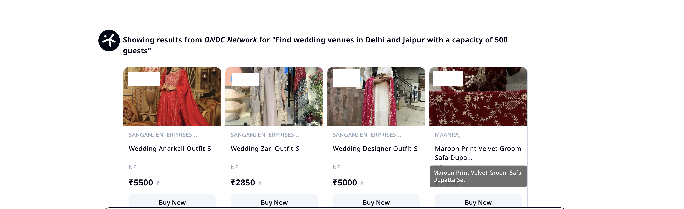

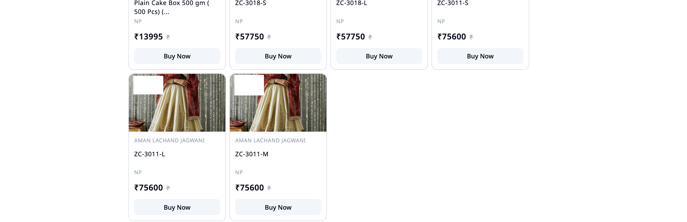

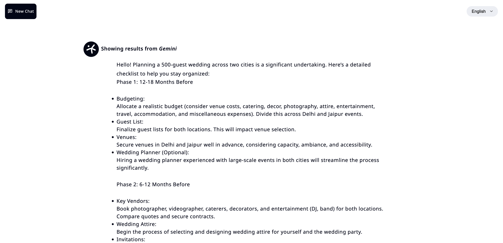

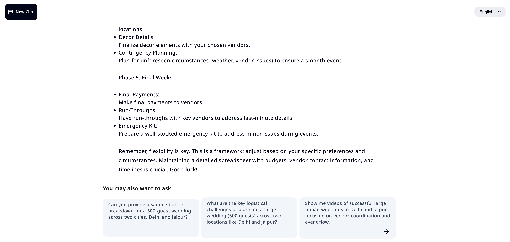


### Agri

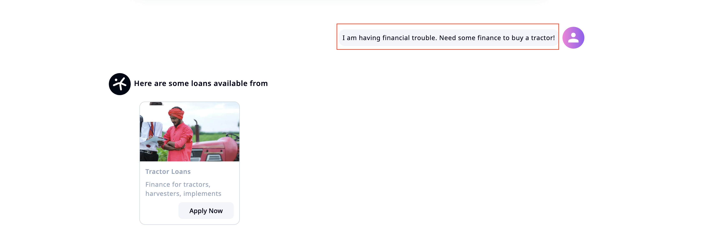

- **Intent**: Need financial help
- **Response**: Loan options from Affiliates

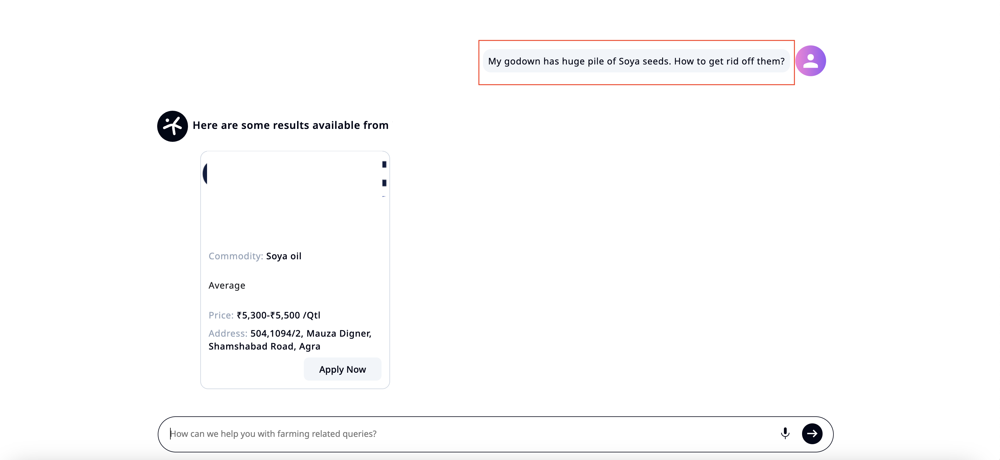

- **Intent**: Have a huge stock in godown; how to clear that off?
- **Response**: market-linkage options from Affiliates to help sell agri products


## References

- [Open Network Aggregator - General Overview](./README.md)
- [Open Network Aggregator - Deployment](./Deployment.md)
- [Vertex AI](https://cloud.google.com/vertex-ai/docs)
- [Generative AI on Vertex AI](https://cloud.google.com/vertex-ai/generative-ai/docs/learn/overview)
- [Source Code](https://github.com/monojit18/Open-Network-Aggregator)
  - This is a Private GH repo and hence is allow-listed
