# Multi Agent Aggregator for Open Network

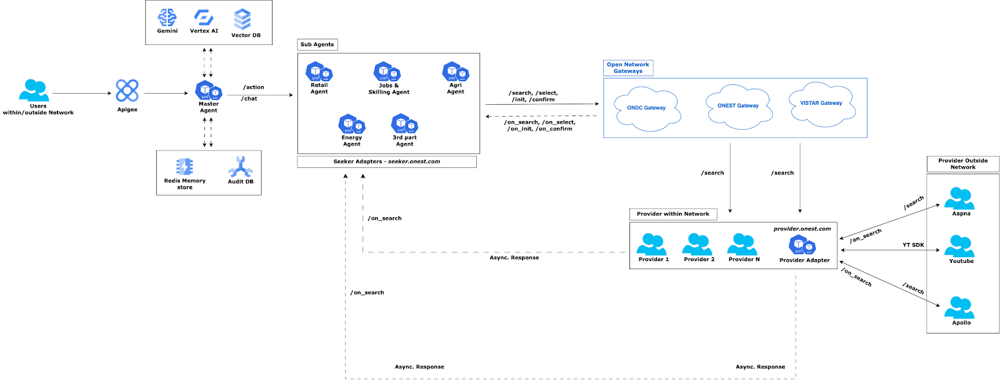

## What is Open Network?

An Open Network essentially creates a level playing field for both buyers and sellers. It removes the control that singular platforms have in traditional e-commerce models, fostering a more open and competitive environment that benefits all participants, including those in the education sector. This can be applied to e-commerce marketplaces, but also to online learning platforms. An open network in education (viz. *ONEST*) can empower learners to find courses and programs from various providers, compare prices and quality, and choose the best fit for their needs. Similarly, educators and content creators can reach a wider audience through multiple platforms, increasing their visibility and potential student base.

Another great example can be ONDC - Open Network for Digital Commerce - which revolutionises the way e-Commerce can work in India by allowing Buyers and Sellers to communicate with each other over the Open Network in a Platform agnostic way and with a seamless experience.

Similar other Open Networks or Agriculture, Healthcare, Energy can be built easily and allow both Demand and Supply-chain ends to communicate easily.

- **Multi-Platform Access:** Buyers can search and purchase goods or services through various applications, not being confined to a single platform. This empowers them to find the best deals and explore a wider range of options.
- **Seller Freedom:** Sellers have the flexibility to list their offerings on multiple apps, increasing their reach and potential customer base. This breaks down the dominance of large platforms and creates a more competitive marketplace.
- **Platform Independence:** The network itself operates independently of any specific application. It establishes protocols and standards that different apps can integrate with to participate. This allows users to choose their preferred apps for buying or selling without limitations imposed by a single platform.

**Open Standards:** The network utilizes open-source technology and standardized protocols. This ensures transparency, fosters innovation by allowing developers to create compatible applications, and promotes fair competition within the network.

# What is Beckn Protocol?

The Beckn protocol creates open, decentralized networks for various industries. It lets platforms, organizations, and governments build these networks for e-commerce, mobility, energy, and more. This open approach is managed by a community and aims to reverse the trend of closed, non-competitive platforms. Beckn's networks allow for specialization and reduce reliance on single platforms, empowering businesses and consumers. This fosters collaboration, innovation, and inclusivity while maintaining competition. The result is a barrier-free digital economy with equal access for all, promoting opportunities across various sectors.

One Protocol infinite potential 

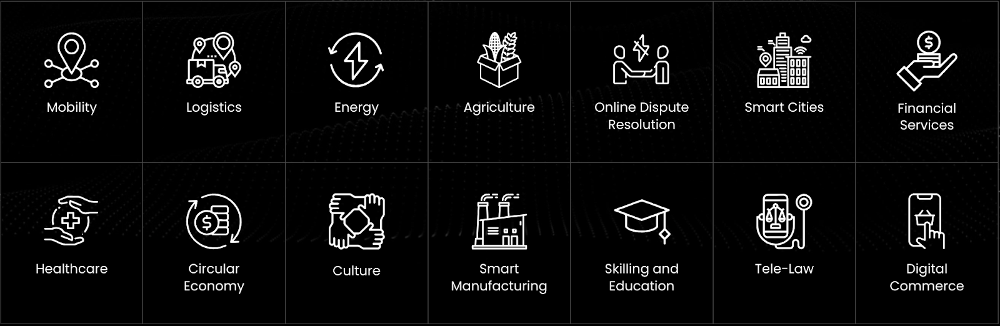

Creating a new digital future, one open network at a time

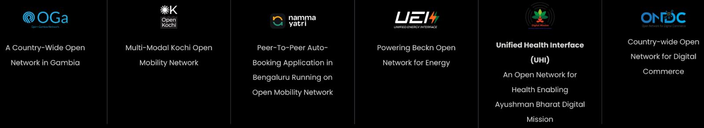

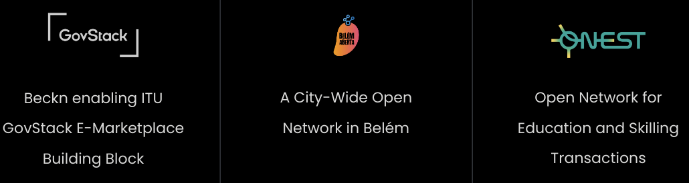

## Purpose

- Allow frictionless integration experience with the Open Networks for NPs
- Provide a Single window deployment experience for NPs
- Pluggable interface to integrate with NPs existing application seamlessly
- In-built - Best practices, Security, Scale, Protocol upgrades

## Objectives

- Build an aggregator of Open Networks - ONDC, ONEST, Agri, Energy and more
- Build for both Provider and Seeker side of the Open Networks
- Build a set of pluggable APIs with zero or minimal configuration or knowledge on any Open networks
- Provide a pair of white-labeled interfaces which can be re-branded easily and plugged into the existing App Eco of the consumer. Consumers would have the ability to integrate into their app flow as well
- Use Gemini based fine tuned models to do NLP to understand the user’s intent; translate into a set of actionable steps specific to a Network
- Build the end to end arch as a multi-agent system with one Master Agent and multiple sub-agents
- Each Sub-agent having domain specific knowledge and can connect to a specific Open Network
- Consolidated responses comes back to Master Agent which then sent back to the Bot frontend

# Functional Architecture

Users want to leverage Open Networks; but do not want to go through the nitty-gritties; and do not even know how many networks, which network etc.

### Scenarios

- Users have an existing Mobile or Web App flow. Wants to integrate this Aggregator to seamlessly connect to any Open Networks
- User does not have an app and replying on us to deliver a complete package - Open Network integration and DFront ends
- User already has a Bot or wants to build a new one connected to Open Networks

### Functional Flow

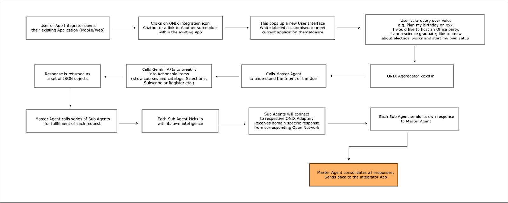

# High-Level Architecture

## Level 1

As a first step towards solving the customer pain points to onboard into ONEST, Google Cloud Open Education (GCOE) service envisioned to provide an L1 Accelerator which in the future roadmap could evolve into a strong line of products to support ONEST customers from Google Cloud and also contribute to the One Google Initiative with ONEST.

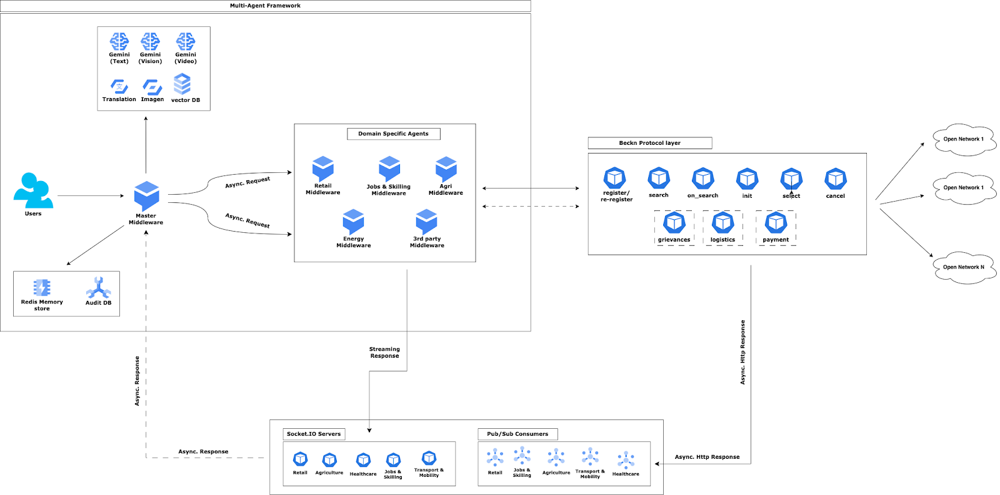

- Multi-agent architecture
- User’s Voice command runs through an NLP to understand the Intent
  - Model - gemini 1.5-pro Fine Tuned with a set of 500 examples
  - Examples are in JSONL format
- Master Agent is the first responder
  - Master Agent connects to Gemini 
  - Responses from Model will return a specific formatted JSON with Providers (*which network to go to?*); **Specific Intents** (Find, Filter, Add, Update); **Action items** (Search, Select, Init, Confirm etc.) and Messages (corresponding data points to send to the Open Network)
  - Passes the JSON to Platform specific Sub-Agents; decided by the **Provider** field as described above 
- All responses from multiple networks reach to **Master-agent**, consolidated and send back as one response back to the font end
- Each **Sub-agent** act like an independent unit capable to communicate with a specific Open Networks and for a specific domain
  - JSON data from **Master-agent** is processed to convert it into a request for a specific Open Network
  - **Sub-agent** send the request to designated Open Network e.g. ONEST (for *Education, Jobs, Skilling*) or VISTAR (for *Agri*)
  - Each **Sub-agent** would take care of Security, Fan-out, Audit logging etc.
  - Each **Sub-agent** will perform standard Open Network specific security checks like Payload Signing, Verification of request header etc.
  - If needed **Sub-agent** will also decide on Fan-out of requests using some event-drive mechanism
- Open Network will broadcast the request from the Sub-agents to the **Providers** or **Sellers** of the Open Network
- The responses from Open Network would be sent directly to the Sub-agents directly as per Open Network specs

**Sub-agents** send the consolidated response back to **Master-agent** and in turn to the frontend and update the same accordingly

## Level-2

# Protocol Adapter (*L1 Accelerator*)

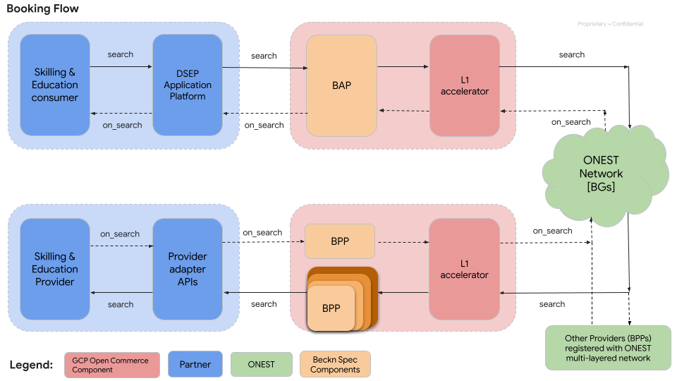

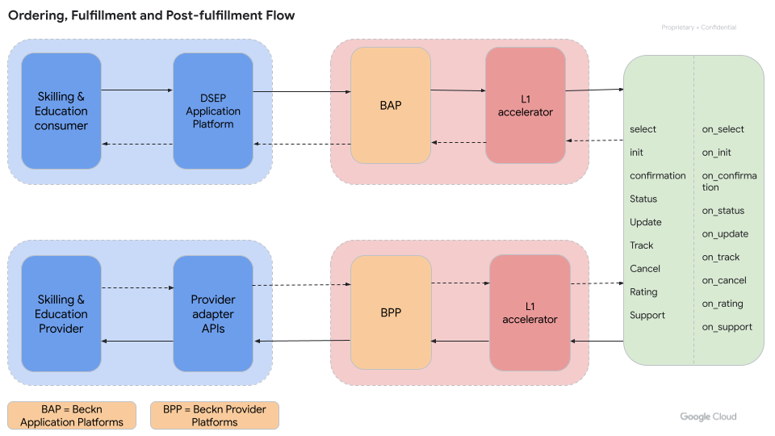

Communication between Sub-agents to Open networks can be direct; but that would need a lot of boiler plate code to be written and multiple different configurations.

To avoid that, there will be an Adapter interface to make the communication between Domain specific Sub-agents to the corresponding Open Network seamless and extensible.

Primary responsibility of the Protocol Adapter will be to handle:

- Protocol validation
- Version management
- Security checks
- Scalability

Following is a logical flow of the protocol adapter for both Provider and Seeker interfaces

## Logical Flow

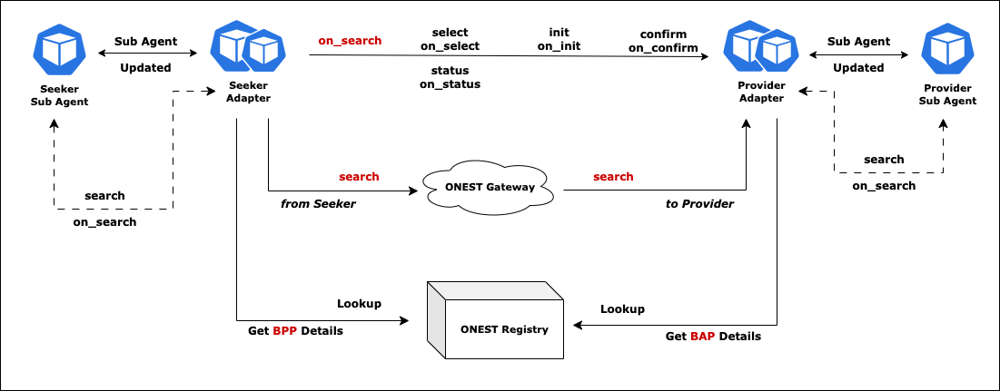

## Logical Flow (*Deep dive*)

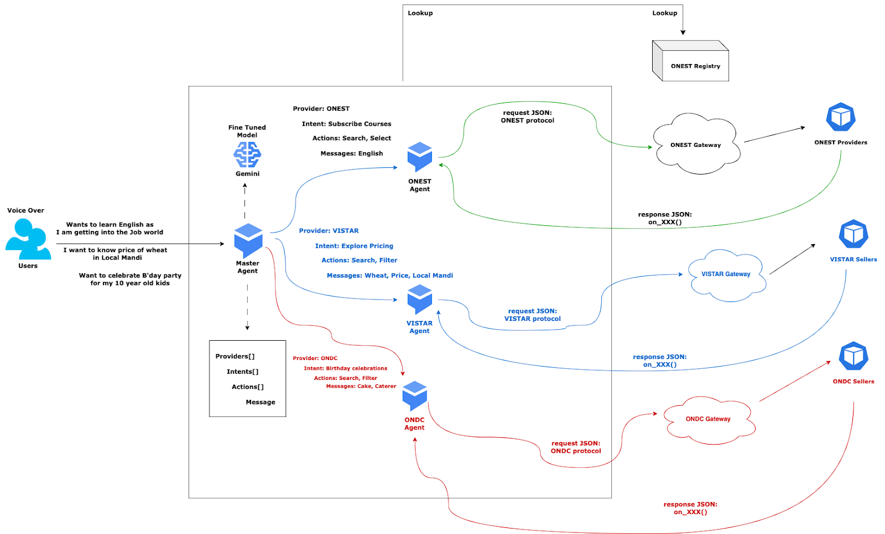

# Sequential Flow

## All Open Networks

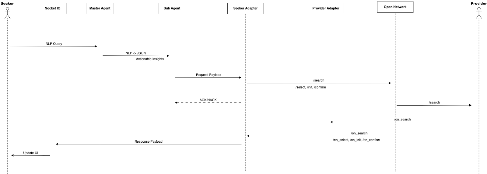

## Integrator Networks (Outside Open Network)

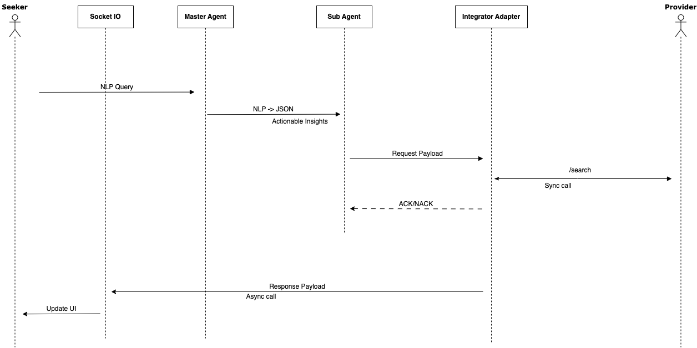

# Deployment Architecture

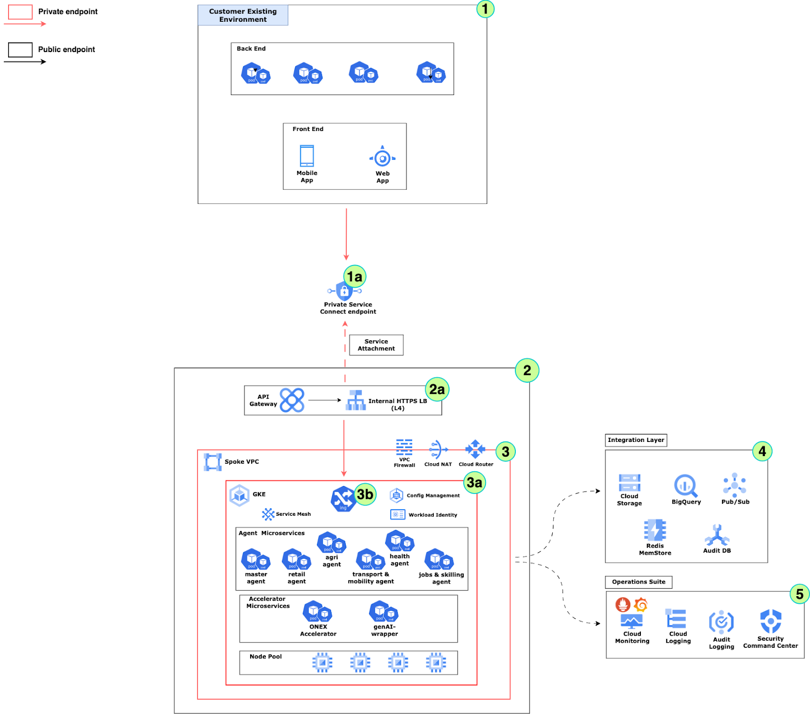

## Architecture Highlights

- Authentication
  - Google IAM to be used as Authentication Provider for managing resources on GCP
  - Identity-aware-Proxy to be enabled for the Global Load Balancer; this will ensure that access to the Front end application and Dashboard app will be authenticated through IAM
  - SSL Certificates to be attached with the each Forwarding rules of the Load Balancer
  - Each environment (*Dev, QA, Pre-Prod and Prod*) would have their own certificate
  - Global HTTPS LB has auto-renewal of certificates
- Authorization
  - Google Organization Policy would be used to provide Authorization for each managed service
  - GKE cluster would have additional layer of RBAC through core K8s
  - Groups over individual identity - Groups provide better management and security. Any person leaving the group or organization, can be managed easily through Groups
    - Groups to be used for management access control for all resources
  - Service Accounts to be used for service level access controls and between service-to-service communication
    - Separate Service Accounts for each Environment
    - Service Accounts Key creation not allowed for all environments except Dev and Test
    - Granular access to Service Accounts as much as possible; avoid higher privileges
- Secrets/Keys Management
  - Cloud KMS service to be leveraged for all Certificate and Key management across all environments
  - Certificate Authority Service - A highly available and scalable Google Cloud service allows us to simplify, automate, and customize the deployment, management and security of private certificate authorities 
  - Secret Manager service to be leveraged for managing Secrets across all environments
- Security
  - Cloud Armor as WAF at global HTTPS Load balancer. Provides protection from multiple types of threats including
    - DDOS attacks
    - SQL injection (SQLi)
    - Cross-site scripting (XSS)
    - Local File Inclusion (LFI)
    - Remote File Inclusion (RFI)
    - Remote Code Execution (RCE)
  - Advanced Security policies like URL pattern matching, ReCaptcha Enterprise etc.
  - Geo-fencing of WAF will be 
  - Automatic rotation of SSL certificates by WAF
  - In-built Ingress security for the backend K8s cluster using GKE Ingress
  - Access Security using OAuth and API Keys for each API exposed
  - Policies and Rules to hide backend APIs and its internal operations
- Performance
  - Highly Scalable
    - GKE cluster would auto-scalable horizontally through HPA
    - GKE supports Vertical scalability through Nodepool Auto Config feature
    - Container Native Load balancing to provide highly scalable access to backend APIs within the cluster
    - This will ensure that Cluster can handle high throughput requirements and create new Microservice instances as CPU/Memory utilization increases. Additionally Nodes also can scale horizontally to accommodate new microservice instances
    - Solution proposes to start with 4 Node Nodepool for micro-services with 4 vCPU:16GB configuration and 2 threads per core
      - This will ensure that initial load is well-handled by the system
      - During subsequent peak load can be distributed horizontally
      - And this ensures that the SLA of 500 TPS
  - High Availability
    - GKE cluster would be deployed as a Regional cluster ensuring HA across 3 Availability Zones
    - All microservices within the cluster would be deployed with minimum 2 replicas for HA
    - Cluster will be sized with additional buffer to keep service running even when a GKE upgrade is going on
  - Service Isolation
    - GKE cluster would have a default system pool to hold K8s specific services and anything that is across the cluster
    - All other micro services specific to this requirement will be deployed on a **Dedicated Nodepool** fully isolated from other services
    - Additional level of segregation of Services through K8s Namespaces
    - Separate cluster for major environments
      - **Dev** and **QA** will be one single cluster separated by Namespaces
      - **Staging** services will be deployed in the same cluster as DEV but in a separate nodepool
      - **Production** will be a separate dedicated cluster
  - Easy Failover
    - System would support Active-Active DR with resources deployed efficiently and cost optimized way; ensuring quick RTO and RPO as well as keeping cost factor into consideration
    - Managed Database service would allow replication within and across regions to ensure HA and seamless Failover; as well as easy Fallback
  - Fault tolerance
    - The Fault Injection and Packet mirroring features for Load Balancer would be used to test system tolerance before deploying onto higher environment
    - Blue/Green deployment for easy rollback through Anthos Service Mesh
    - Traffic Splitting to ensure the stability of the newly deployed version
- Monitoring and Observability
  - GKE cluster will have **GKE Service Mesh** deployed for 
    - Detailed insights of each service
    - Hierarchical view of services within the cluster; detailed view of internal service-to-service communication
    - Traffic Splitting within the cluster
    - Blue/Green deployment
    - Fault Injection
    - Circuit Breaking
  - Detailed Insights of Database performance through **Cloud Operations**
    - Service status
    - Alerts
    - Notifications
    - Workflow to take action if Service is in a pre-defined state; e,g,
      - Decision to perform DR
      - Add additional Replicas for scaling
- Version Management
  - Seamless versioning of APIs
  - Support for previous versions through Artifact Registry
  - Easy Rollback and Rollover
  - Full and Incremental backups of Database
  - Backup for GKE for managing config files, policies and states

## DevOps Suite

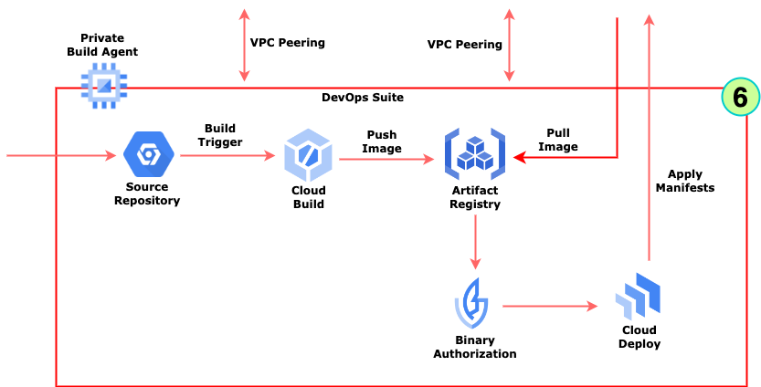

- **DevOps Flow**

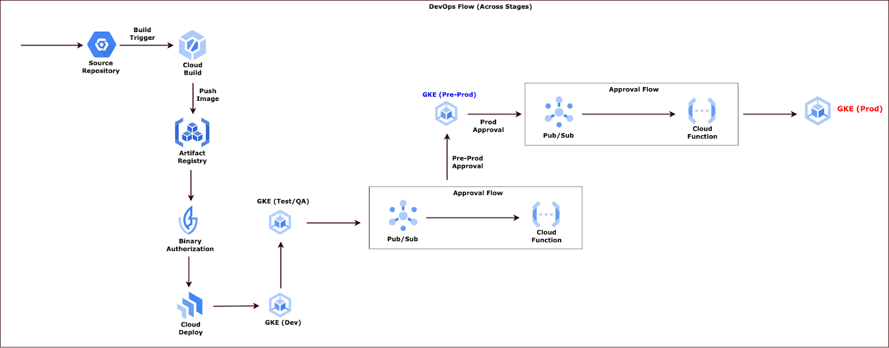

- **Build Trigger** is created and attached to the Cloud Source repository. This initiates a **Cloud Build** step
- Build steps build the source code and generates a **Docker Container** image
- FInal step of Cloud Build Push image to **Artifact Registry**
- **Binary Authorization** policy ensures only trusted container images are deployed on Google Kubernetes Engine (GKE)
- **Cloud Deploy** step is initiated and deploys the image on **GKE (DEV)** environment
- A test and feedback cycle is performed. Post successful testing, same image is deployed to **GKE (QA)** environment
- A test and feedback cycle is performed. Post successful testing an **Approval Workflow** **is** initiated for DevOps admin before moving to **Pre-Prod/Staging** environment
- Post approval, same image is deployed to **GKE (Pre-Prod)** environment
- A test and feedback cycle is performed. Post successful testing an **Approval Workflow** **is** initiated for DevOps/Production admin before moving to **Production** environment

A test and feedback cycle is performed. Post successful testing same image is deployed to **GKE (Production)** environment

## References

- ### [ONEST Low Level Design](./assets/ONEST-Aggregator-LLD.pdf)

- ### [ONDC: Tech Quickstart Guide](https://github.com/ONDC-Official/ONDC-Protocol-Specs/blob/master/protocol-specifications/docs/draft/Tech%20Quickstart%20Guide.md)

- ### [ONEST Starter Pack](https://starterpack.onest.network/)

