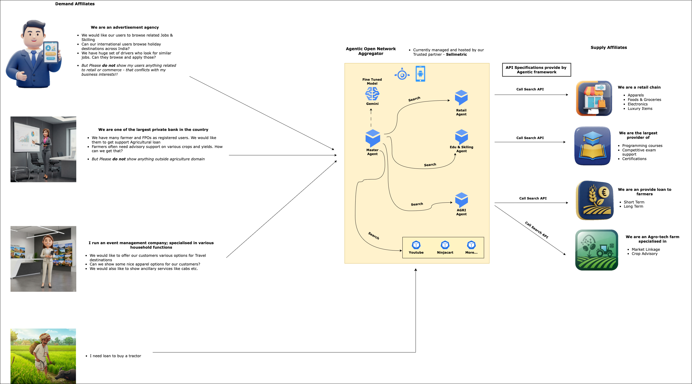
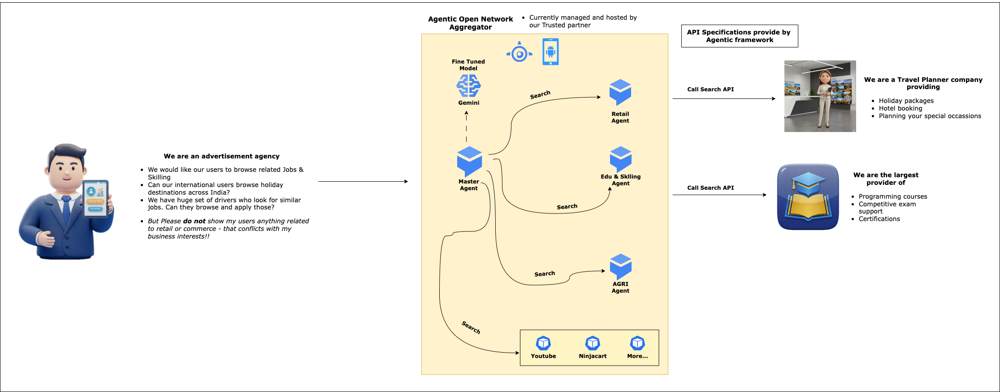
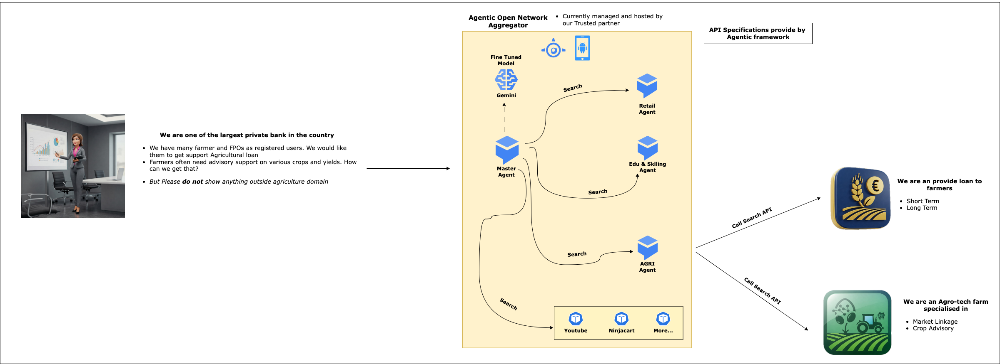

# Multi Agent Aggregator for Open Network -

## High Level Overview

# Introduction

**Google Agentic framework** aims to provide an easy to integrate interface for Buyers/Seekers wanting to connect to the various Open Networks and/or various Content providers like Video, Webcast, Podcasts, Online Tutorials, Digital Catalogs etc. to name a few.

Google Agentic framework will build a bridge between the Demand and Supply sides of the Network and allow a seamless, frictionless communication between the two.

This Document contains the specifications for the APIs exposed by **Google Agentic framework** on the Demand side (*Buyers/Seekers*) and also the specification for the APIs to be hosted on the Supply side (*Buyer Apps, Seeker Apps, Digital Content Providers etc*.)

# High-Level View

# Business View

## Scenario 1

## Scenario 2

# High-Level Architecture

- Multi-agent architecture
- Bridge between Demand and Supply
  - **Demand side**: Buyers/Seekers
  - **Supply side**: BAPs on Open Network, various Digital Content providers who are not on any Open Networks
- User’s Voice command runs through an NLP to understand the Intent
- **Master Agent** is the first responder
  - **Master Agent** connects to Gemini 
  - Responses from Model will return a specific formatted JSON with **Specific Intents** (*which network to go to?*); **Action items** (*Search*) and **Messages** *(corresponding data points to send to the Open Network*)
  - Passes the JSON to Platform specific Sub-Agents
- Responses from each Network is sent back to the front end over a **Websocket connection**
- Each **Sub-agent** act like an independent unit capable to communicate with a specific Open Networks and for a specific domain
  - JSON data from **Master-agent** is processed to convert it into a request for a specific Open Network
  - **Sub-agents** can send the request to Open Networks e.g. ONEST (for *Education, Jobs, Skilling*) or ONDC (for *Retail*) based on the instruction from **Master Agent**
    - **Sub-agents** will send the request to a BAP interfaces in the Open Network like Buyer Apps or Seeker Apps; which in-turn will call the designated Open Network
    - **Providers** on the Open network would respond back to the BAPs as per [Beckn protocol](https://becknprotocol.io/); which in-turn sends the response back to the front end apps (*Buyers/Seekers*)
  - **Sub-agents** can send the request to Content providers outside of any Open Network e.g. Videos, Digital Catalogs, Web/Podcasts etc. based on the instruction from **Master Agent**
    - Each non-Network Content provider can send the digital contents directly to the front end apps (*Buyers/Seekers*)

# Logical View

# End to End Workflow

# Sequential Flow

## Affiliate Networks

- These are Supply side **Partners** or **Affiliates**

- They have their own Buyer Apps to fetch data from various Open Networks like ONDC

  - They need to follow the API specs provided by **Google Agentic framework** to integrate into the system. Agentic framework will call the APIs exposed by Affiliates to fetch their contents
  - Visibility of their data depends on getting more Buyers registering onto their system
  - Separate Buyer Apps needed for separate Networks like *Retail, Agri* etc.
  - Building an aggregator platform themselves need more effort and visibility would still be an issue; to bring more Buyers across segments onto their platform

- **Google Agentic framework** increases visibility of their data by exposing it to multiple Demand side Affiliates who might not event be on any Open Network

  - Example - Banks, Jobs' Sites, Media platforms etc.

  - These Demand side affiliates can simply integrate with Agentic framework (*along with a conversational UI*) and launch from their existing apps or websites

  - This way the users of these Demand side affiliates can reach to multiple Supply side affiliates 

  - At the same time, each Supply side affiliate is exposed to multiple Demand side affiliates and their end users immediately 

    

## Integrator Networks (*Outside Open Network*)

- These are Partners or Integrators

# Integrator App

## What it is?

Agentic framework is headless service to connect to various types of backends with intelligence to understand the users' requirement and their outing requests accordingly. The framework can be realised by being integrated to a UI framework which shows up contents from various Open Networks and Providers with ease. **Integrator App** serves that purpose.

- Integrates with **Google Agentic framework**

- Maintains the state of entire application

- Manages end user preferences viz. Preferred Networks, Intended Verticals of Open Networketc.

- Logs all transactions in an Audit Database asynchronously

- Basic Analytics

- **Future Plans**

  - Advanced Analytics and Visualisation

  - Contextual or Profile based Search

  - More seamless integration with Supply side affiliates

    

## Transactional flow

How can Agentic framework complete a transaction for the selected content(s)? A Transaction flow consists of Order placement and the subsequent payment process.

- This is primarily done by Integrator or hosting app with Agentic facilitating the integration
- Integrator app Searches for an item
- Each search result contains an **embedded url** for that particular product
- Integrator app launches an **embedded Webview** to show the product details within Webview or IFrame
- Add-to-Cart and Check-out happens through the embedded webview
- Once Order is placed, Integrator app receives Order confirmation response along with details Order Info as JSON object

# Points to Note

> - **Google Agentic framework**
>   - Understands user’s intent from Text or Voice
>   - Break that into Actionable insights
>   - Route requests to appropriate BAPs and/or Content Providers(*Outside Network*)
> - **Integrator App** will be responsible for managing the configuration points for both Demand and Supply side of this application flow.
>   - **Demand side**
>     - The configuration options for Buyers and Seekers would be managed by Interator App in its own database
>     - Preferred Networks - Preferred target networks to connect from **Google Agentic framework**
>     - Intended Verticals - Preferred Verticals to support by **Google Agentic framework**
>     - Maintain API security by creating and managing API key which needs to be sent through API header
>   - **Supply Side**
>     - Maintain a list of default BAPs and Content Providers(*Outside Network*)
>     - Log all transactions in an Audit DB
>
> - Implement Basic Analytics
> - Implement Advanced Analytics (*Future*)
>
> Is **Google Agentic framework** completely **Stateless**?
>
> - Current implementation is Stateless with a only light-weight *Semantic* memory history for agents
> - **Future Plans**
>   - Add various different types of memories - *Episodic, Procedural* etc. to respond with better context and past actions by end user(s)
>   - Add **Emotions** into each *Sub-agent* and respond with more empathy and care
>   - Enable an intense search capability within a specific and selected set of contents - documents, videos, images etc.
>   - Respond with a more detailed, generated content based on various user parameters like - *profile, context, sentiments* etc.

## References

- [Vertex AI](https://cloud.google.com/vertex-ai/docs)
- [Generative AI on Vertex AI](https://cloud.google.com/vertex-ai/generative-ai/docs/learn/overview)
