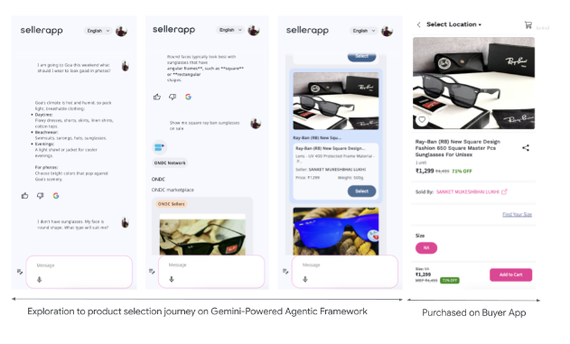

# Multi Agent Aggregator for Open Network -

## High Level Overview

### Nomenclatures

| Terms                                             | Description                                                  |
| ------------------------------------------------- | ------------------------------------------------------------ |
| Beckn protocol                                    | An open protocol for commerce to help diverse businesses to come together and re-imagine their business |
| Buyer App                                         | An Application platform or App for the Buyers. In the context of Open Networks or Beckn protocol this is termed as **BAP** |
| Seller App                                        | An Application platform or App for the Sellers. In the context of Open Networks or Beckn protocol this is termed as **BPP** |
| [Demand-side Affiliates](#Demand-side Affiliates) | Businesses, Organisations who are not part of Open Network(s) but want their end users to leverage contents or services from multiple Open networks |
| [Supply-side Affiliates](#Supply-side Affiliates) | These are primarily Buyer Apps or BAPs who can fetch contents or services from various Seller Apps. But please note, that the Agentic framework is open for other types of content providers as well. e.g. Seller Apps or BPPs in any Open Network can become a Supply-side Affiliate |
| [Integrator App](#Integrator App)                 | This is the Mobile and Web App that integrates with the **Gemini Powered Agentic framework**. This App is managed by partners of GCP and provided as a SaaS solution or a Managed Service to end *Demand-side Affiliates* |

# Introduction

**Gemini Powered Agentic framework** aims to provide an easy to integrate interface for Buyers/Seekers wanting to connect to the various Open Networks and/or various Content providers like Video, Webcast, Podcasts, Online Tutorials, Digital Catalogs etc. to name a few.

Gemini Powered Agentic framework will build a bridge between the Demand and Supply sides of the Network and allow a seamless, frictionless communication between the two.

This Document contains the specifications for the APIs exposed by **Gemini Powered Agentic framework** on the Demand side (*Buyers/Seekers*) and also the specification for the APIs to be hosted on the Supply side (*Buyer Apps, Seeker Apps, Digital Content Providers etc*.)

# Why do we need this?

Despite the immense potential of ONDC and other Open Networks, joining and leveraging the network presents several challenges for buyer apps:

- **Onboarding Complexity:** Navigating the technical complexities and establishing connections with multiple seller apps can be a resource-intensive process
- **Consumer Accountability:** Buyer apps are responsible for ensuring a positive user experience (from purchase to receipt/return), even though they have limited control over the sellers and their fulfilment processes

Google is committed to supporting the growth of Open Networks and building a Gemini-powered agentic framework to solve these challenges.

It comprises of 3 key components:

1. **Customisable Conversational Commerce:** An end-user facing conversational interface powered by a main Gemini Agent (viz. *Master Agent*) would interact with end users. This conversational approach creates a more engaging and personalised shopping experience for end users, mirroring the natural flow of human interaction
2. **Domain-Specific Sub-Agents:** Upon detecting purchase intent, the main agent activates specific Gemini Sub-Agents. These sub-agents provide access to open networks across various domains, such as fashion, groceries, etc.
3. **Buyer App Integration:** Each Gemini Sub-Agent is integrated with leading buyer apps linked to specific Open Network domains. 

# High-Level View

# Business View

## Who are Demand-side Affiliates

- An *Enterprise* who wants their end users to browse Jobs & Skilling
- A *Travel Agency* wants their end users across the globe to browse holiday destinations across India
- A *Bank* or *Financial institution* has many Farmers registered with them. They want these users to get quick and easy loan through various Agri Loan providers
- An *FPO* allowing their registered farmers to Buy or Sell Agricultural products from various agro-tech farms or platforms
- And many more.....

## Scenarios

Following diagrams are self explanatory depicting two different scenarios

### Scenario 1

### Scenario 2

# High-Level Architecture

- Multi-agent architecture
- Bridge between Demand and Supply
  - **Demand side**: Buyers/Seekers
  - **Supply side**: BAPs on Open Network, various Digital Content providers who are not on any Open Networks
- User’s Voice command runs through an NLP to understand the Intent
- **Master Agent** is the first responder
  - **Master Agent** connects to Gemini 
  - Responses from Model will return a specific formatted JSON with **Specific Intents** (*which network to go to?*); **Action items** (*Search*) and **Messages** *(corresponding data points to send to the Open Network*)
  - Passes the JSON to Platform specific Sub-Agents
- Responses from each Network is sent back to the front end over a **Websocket connection**
- Each **Sub-agent** act like an independent unit capable to communicate with a specific Open Networks and for a specific domain
  - JSON data from **Master-agent** is processed to convert it into a request for a specific Open Network
  - **Sub-agents** can send the request to Open Networks e.g. ONEST (for *Education, Jobs, Skilling*) or ONDC (for *Retail*) based on the instruction from **Master Agent**
    - **Sub-agents** will send the request to a BAP interfaces in the Open Network like Buyer Apps or Seeker Apps; which in-turn will call the designated Open Network
    - **Providers** on the Open network would respond back to the BAPs as per [Beckn protocol](https://becknprotocol.io/); which in-turn sends the response back to the front end apps (*Buyers/Seekers*)
  - **Sub-agents** can send the request to Content providers outside of any Open Network e.g. Videos, Digital Catalogs, Web/Podcasts etc. based on the instruction from **Master Agent**
    - Each non-Network Content provider can send the digital contents directly to the front end apps (*Buyers/Seekers*)

# Logical View

# End to End Workflow

# Integrator App

## What it is?

Agentic framework is headless service to connect to various types of backends with intelligence to understand the users' requirement and their outing requests accordingly. The framework can be realised by being integrated to a UI framework which shows up contents from various Open Networks and Providers with ease. ***Integrator App*** serves that purpose.

- Integrates with **Gemini Powered Agentic framework**

- Maintains the state of entire application

- Manages end user preferences viz. Preferred Networks, Intended Verticals of Open Network etc.

- Logs all transactions in an Audit Database asynchronously

- Basic Analytics

- **Future Plans**

  - Advanced Analytics and Visualisation

  - Contextual or Profile based Search

  - More seamless integration with Supply side affiliates

    

## Transactional flow

How can Agentic framework complete a transaction for the selected content(s)? A Transaction flow consists of Order placement and the subsequent payment process.

- This is primarily done by Integrator or hosting app with Agentic facilitating the integration
- *Integrator App* Searches for an item
- Each search result contains an **embedded url** for that particular product
- *Integrator App* launches an **embedded Web-view to show the product details within Web-view or IFrame
- Add-to-Cart and Check-out happens through the embedded webview
- Once Order is placed, *Integrator App* receives Order confirmation response along with details Order Info as JSON object

# How do Affiliates integrate?

## Demand-side Affiliates

- Affiliate requests API Access to the hosting partner of the *Integrator App*
- A Google Form link is sent to the Affiliate by GCP partner hosting the *Integrator App*
- Affiliate fills up the form with details of *User Profile* information to be sent to Agentic framework
  - Fields to be sent to Agentic - **City, Mobile No., Email, Latitude, Longitude** are mandatory fields
  - Any other fields that Affiliate wants to send to the Agentic framework

- The fields are kept as a configuration parameters by *Integrator App*, mangled by GCP partner hosting the *Integrator App*
- An API Key is generated for the Affiliate and sent back to them
- API spec is shared with the Affiliate

### What happens next?

- Affiliate adds an UI Element in their existing Mobile or Web App

- The UI Element should have an action to call the **Search** API exposed by the *Integrator App*

  > [!NOTE]
  >
  > - There is one and only one API to be consumed - a **Search** API call to the *Integrator App*
  > - This API flows through the layers of Agentic framework and performs the desired action(s)
  > - All User Profile information as decided with Demand Affiliate are sent with the API call

- *Integrator App* is launched with its default UI and Agentic framework integrated

- From now on, all user intents (*Text or Voice commands*) are sent to the *Integrator App* which in turn calls the Agentic framework.

- The information reaches the Supply-side affiliates; which then returns appropriate content back to the Affiliate's app

> [!NOTE]
>
> ### What is so special about the returned Content?
>
> - Content is not *User Action* driven but **User Intent** driven
> - *User Actions* are characterised traditionally by actions on various UI elements like Menu items, Buttons etc.; whereas **User Intents** are initiated by Natural Language Processing (*NLP*) i.e. inferencing from *Text* or *Voice* commands
>   - Inference can relate to a direct action like fetching content from a specific provider
>     - *I want to buy a sunglasses of XXX brand*
>   - Inference can relate to a set of indirect actions
>     - *Please plan my holiday this summer  to XXX location*
>     - *I would like to celebrate my 20th b'day with a small group of friends. Please suggest!*
>       - Fetching contents from multiple providers
>       - Suggesting Alternative actions Or Follow up questions
>       - Generating contents matching the user's intents
>       - And a combination of all above; which translates into an end to end *action planner*

## Supply-side Affiliates

- Affiliate requests API Access to the hosting partner of the *Integrator App*

- Affiliate is sent the API Spec to be hosted by Affiliate

  > [!Note]
  >
  > - Only one API - **Search**
  > - Affiliate can decide to host it as Synchronous or Asynchronous mode
  > - Agentic framework will call this API based on User's intent (*Text* or *Voice* commands)

- A Google Form link is sent to the Affiliate by GCP partner hosting the *Integrator App*

- Affiliate fills up the form with the API details 

  - API Url
  - Response body
    - This should match the API Spec shared by the hosting partner of the *Integrator App*

- An API Key is generated for the Affiliate and sent back to them

- An optional  *Callback URL* is sent to the Affiliate for calling this to complete any transaction - payment or form submission etc.

# Points to Note

> [!Note]
>
> - **Gemini Powered Agentic framework**
>   - Understands user’s intent from Text or Voice
>   - Break that into Actionable insights
>   - Route requests to appropriate BAPs and/or Content Providers(*Outside Network*)
> - ***Integrator App*** will be responsible for managing the configuration points for both Demand and Supply side of this application flow.
>   - **Demand side**
>     - The configuration options for Buyers and Seekers would be managed by Interator App in its own database
>     - Preferred Networks - Preferred target networks to connect from **Gemini Powered Agentic framework**
>     - Intended Verticals - Preferred Verticals to support by **Gemini Powered Agentic framework**
>     - Maintain API security by creating and managing API key which needs to be sent through API header
>   - **Supply Side**
>     - Maintain a list of default BAPs and Content Providers(*Outside Network*)
>     - Log all transactions in an Audit DB
>
> - Implement Basic Analytics
> - Implement Advanced Analytics (*Future*)
>
> Is **Gemini Powered Agentic framework** completely **Stateless**?
>
> - Current implementation is Stateless with a only light-weight *Semantic* memory history for agents
> - **Future Plans**
>   - Add various different types of memories - *Episodic, Procedural* etc. to respond with better context and past actions by end user(s)
>   - Add **Emotions** into each *Sub-agent* and respond with more empathy and care
>   - Enable an intense search capability within a specific and selected set of contents - documents, videos, images etc.
>   - Respond with a more detailed, generated content based on various user parameters like - *profile, context, sentiments* etc.

# Sequential Flow

## Affiliate Networks

- These are Supply side **Partners** or **Affiliates**

- They have their own Buyer Apps to fetch data from various Open Networks like ONDC

  - They need to follow the API specs provided by **Gemini Powered Agentic framework** to integrate into the system. Agentic framework will call the APIs exposed by Affiliates to fetch their contents
  - Visibility of their data depends on getting more Buyers registering onto their system
  - Separate Buyer Apps needed for separate Networks like *Retail, Agri* etc.
  - Building an aggregator platform themselves need more effort and visibility would still be an issue; to bring more Buyers across segments onto their platform
  - Examples
    - Retail Buyer Apps or Seller Apps
    - Various Service providers
    - Loan or Credit providers

- **Gemini Powered Agentic framework** increases visibility of their data by exposing it to multiple Demand side Affiliates who might not event be on any Open Network

  - These Demand side affiliates can simply integrate with Agentic framework (*along with a conversational UI*) and launch from their existing apps or websites

  - This way the users of these Demand side affiliates can reach to multiple Supply side affiliates 

  - At the same time, each Supply side affiliate is exposed to multiple Demand side affiliates and their end users immediately

  - Example

    - Banks, Insurance agencies
    - Travel & Tourism agencies 
    - Jobs' and Skilling sites
    - Media platforms
  
    

## Integrator Networks (*Outside Open Network*)

- These are Partners or Integrators who has publicly exposed APIs to share their contents

- **Gemini Powered Agentic framework** calls these APIs directly and send the contents to the *Integrator App* asynchronously

- Examples
  - YouTube and other Video content providers
  
  - Weather data providers
  
  - Mandi price providers
  
    

## How to Distribute this solution?

### Software-as-a-service Model (*Self-hosted*)

- Single Tenant deployment; separate instance for each customer(s) and their environment(s)
- Fully pluggable with the customer's existing workloads over a secure Private Service Connect endpoint
- Seamless integration with various Open networks (viz. *ONDC, ONEST* etc.) and 3rd party integrators (viz. *Youtube, Ninjacart* etc.)
- Demand-side Affiliate decide to host and manage the suction on their own
- The deployment will be running on the GCP tenant of the Demand-side Affiliate
- GCP Partners can help deploy the solution with a One-time Consultation fee
  - Optionally, an Annual maintenance for a cost can be planned with the GCP partner
- Demand-side Affiliate get access to the source code in the Github repository
  - The code is distributed with [Apache License, Version 2.0](https://www.apache.org/licenses/LICENSE-2.0)
- Demand-side Affiliate can decide to clone or fork the repository for further customisation
- Demand-side Affiliate choose the Supply-side affiliates of their own choice
  - Configure parameters accordingly
  - Integrate their own App(s) with the framework
- The Consumption cost of the solution running on GCP tenant of the Demand-side Affiliate will be borne by them

> [!TIP]
>
> Demand-side Affiliate can do either clone or fork of the repository. Forking is recommended as future changes in the main repository can be easily puled-in.
>
> Similarly contributing back to the mail repository would lao be easier with forking approach.

### Managed Service Model

- Multi-tenant deployment; single instance for each customer(s) and their environment(s)
- Seamless integration with various Open networks (viz. *ONDC, ONEST* etc.) and 3rd party integrators (viz. *Youtube, Ninjacart* etc.)
- Demand-side Affiliate do not want to manage it end to end; but would like to integrate and leverage he service
- GCP Partner hosts the solution on their GCP tenant as a *multi-tenant* offering
- Choose Supply-side Affiliates and share the API Specifications with them 
- Configure mandatory settings
- Connect with the Affiliate API and complete integration
- Expose API for Demand-side Affiliates; manage each Demand-side Affiliate as one tenant
  - Track usage and Calculate cost for each tenant (*Demand-side Affiliate*)
  - Charge back to the Demand-side Affiliate based on a metric; e.g. Usage, No. of Requests or any other custom metric decided between the Demand-side Affiliate and the GCP Partner

# How does it all look like?

## Retail

### Dashboard

- **Intent**: Show me Handbags
- **Response**: Handbags from ONDC network by various Affiliates

- **Intent**: Show me Sunglasses from Rayban
- **Response**: Sunglasses from ONDC network by various Affiliates

- **Intent**: Plan my daughter's marriage ceremony
- **Response**: Planner from multiple Affiliates - ONDC, Youtube Videos and a from Gemini LLM

### Agri

- **Intent**: Need financial help
- **Response**: Loan options from Affiliates

- **Intent**: Have a huge stock in godown; how to clear that off?
- **Response**: market-linkage options from Affiliates to help sell agri products

# References

- [Vertex AI](https://cloud.google.com/vertex-ai/docs)
- [Generative AI on Vertex AI](https://cloud.google.com/vertex-ai/generative-ai/docs/learn/overview)
- [How to Deploy?](./Deployment.md)
